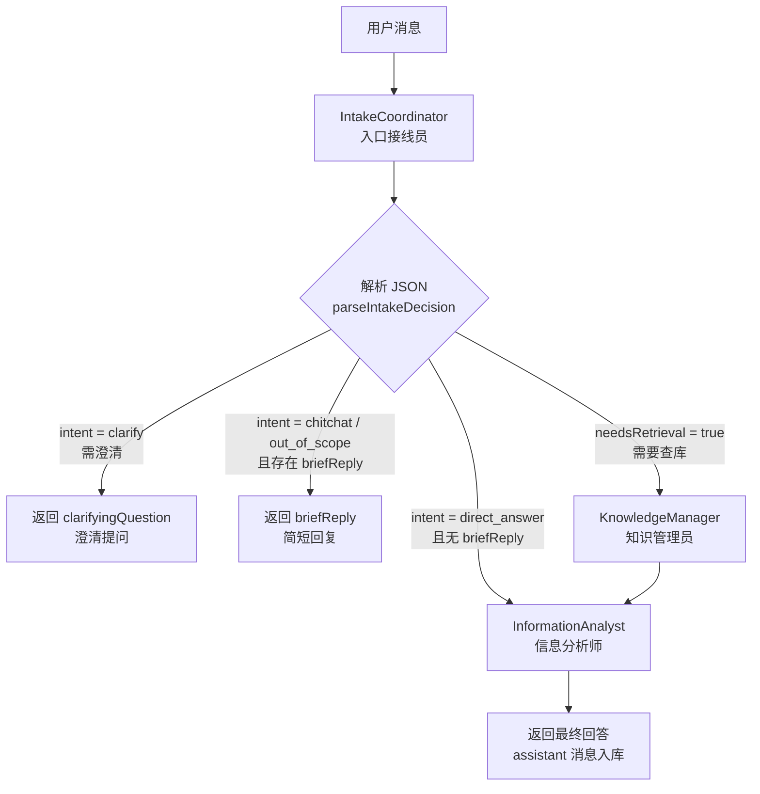

# FamBrain / Agent

基于 **Next.js（App Router）** 的家庭协作型对话应用：注册登录、成员审核、会话与消息持久化，以及 **P0 多 Agent 聊天闭环**（意图路由 → 知识库检索 → 归纳回答，SSE 流式）。向量检索、LangGraph、事实核查等见路线图 P1/P2。

## 技术栈

| 层级 | 选型 |
|------|------|
| 框架 | Next.js 16、React 19 |
| 数据库 | SQLite + Prisma 7（客户端生成至 `src/generated/prisma`） |
| 校验 | Zod |
| 认证 | httpOnly Cookie + JWT（`jose`）、密码哈希（`bcryptjs`） |
| 包管理 | **pnpm**（见 `packageManager`；勿提交 `package-lock.json`） |

开发本仓库前，请先阅读根目录 [`AGENTS.md`](./AGENTS.md)：当前 Next.js 与常见教程版本存在差异，以 `node_modules/next/dist/docs/` 为准。

## 快速开始

**环境：** Node.js 20+；**包管理仅使用 [pnpm](https://pnpm.io/)**（可 `corepack enable` 后与本仓库 `packageManager` 字段对齐）。

```bash
pnpm install
cp .env.example .env
# 生产环境请务必设置足够长的 JWT_SECRET（见下表）
pnpm run db:migrate
pnpm run db:generate
# 本地对话依赖 Ollama，请先安装并拉取模型，例如：
#   ollama pull qwen2.5:14b
pnpm run dev
```

浏览器访问 [http://localhost:3000](http://localhost:3000)。聊天需本机 **[Ollama](https://ollama.com/)** 已启动，且 `.env` 中 `OLLAMA_BASE_URL` / `OLLAMA_MODEL` 与本地已拉取模型一致。

**pnpm 10+** 若安装后提示需批准依赖的构建脚本（如 `prisma`、`better-sqlite3`），在本仓库根目录执行一次 `pnpm approve-builds` 并按提示勾选即可；`package.json` 里已配置 `pnpm.onlyBuiltDependencies` 作为允许构建的名单，新开环境仍可能需要你本地确认一次。

**better-sqlite3：** 若运行时报 `Could not locate the bindings file`，在项目根执行 `pnpm run rebuild:native`（等同 `pnpm rebuild better-sqlite3`），必要时先执行 `pnpm approve-builds` 允许该包跑安装脚本。

- **首个注册用户**会成为 `ADMIN`；其余成员默认 `PENDING`，需具备「成员审核」权限的账号在 `/admin/users` 通过后变为 `ACTIVE` 才可进入主界面。
- **聊天区**：侧栏会话与历史来自数据库；发送消息走 `POST /api/conversations/:id/messages`（**SSE 流式**），经 **Orchestrator → Pipeline → 三个 Worker Agent** 生成回复，**仅将最终 assistant 正文落库**（中间路由/检索结果在内存传递，不写 `messages` 表）。
- **登录/注册表单**使用 `src/actions/auth.ts`（Server Actions）；业务逻辑在 `src/server/auth/`，与 REST API 共用。

## 脚本（pnpm）

| 命令 | 说明 |
|------|------|
| `pnpm run dev` | 本地开发 |
| `pnpm run build` / `pnpm run start` | 构建与生产启动 |
| `pnpm run lint` | ESLint |
| `pnpm run db:generate` | 生成 Prisma Client |
| `pnpm run db:migrate` | 开发环境迁移 |
| `pnpm run db:push` | 无迁移文件时推送 schema（慎用） |
| `pnpm run db:studio` | Prisma Studio |
| `pnpm run rebuild:native` | 重新编译 `better-sqlite3`（解决缺少 `.node` 绑定） |

## 环境变量

复制 `.env.example` 为 `.env` 后按需修改。

| 变量 | 必填 | 说明 |
|------|------|------|
| `DATABASE_URL` | 建议 | 默认 `file:./prisma/dev.db`（相对仓库根目录） |
| `JWT_SECRET` | 生产必填 | 长度 ≥ 24；开发未设置时会使用占位密钥（控制台告警） |
| `JWT_RENEW_BEFORE_EXPIRY_SEC` | 否 | 中间件刷新 Cookie 的提前量（秒），默认约 4 天 |
| `LOGIN_RATE_LIMIT_MAX` / `LOGIN_RATE_LIMIT_WINDOW_MS` | 否 | 登录接口内存限流 |
| `REGISTER_RATE_LIMIT_MAX` / `REGISTER_RATE_LIMIT_WINDOW_MS` | 否 | 注册接口内存限流 |
| `LOGOUT_RATE_LIMIT_MAX` / `LOGOUT_RATE_LIMIT_WINDOW_MS` | 否 | 登出接口内存限流 |
| `TRUST_PROXY_HEADERS` | 否 | 设为 `true` 时信任 `X-Forwarded-*`（反向代理场景） |
| `SECURITY_ENABLE_HSTS` | 否 | 设为 `true` 时在响应头启用 HSTS |
| `FAMBRAIN_MEMBERSHIP_AUDIT_ID_SUFFIX` | 否 | 身份证号后缀匹配则拥有「审核成员」权限；不设则用代码内默认值 |
| `OLLAMA_BASE_URL` | 建议 | 默认 `http://127.0.0.1:11434`；对话与 Agent 均通过此地址访问 Ollama |
| `OLLAMA_MODEL` | 建议 | 默认 `qwen2.5:14b`；Intake / Analyst 等未单独配置时使用 |
| `OLLAMA_MODEL_INTAKE_COORDINATOR` | 否 | 仅入口接线员专用模型；不配则等于 `OLLAMA_MODEL` |
| `OLLAMA_MODEL_EMBED` | 否 | 嵌入模型（P2 向量检索预留）；默认 `nomic-embed-text` |
| `OLLAMA_STREAM_THINK` | 否 | 流式是否请求 thinking；不支持时服务端会自动降级重试 |

单机内存限流不适用于多副本；上生产请在前端网关或 Redis 等侧做统一限流。

## 代码结构（P0）

| 路径 | 职责 |
|------|------|
| `src/agents/orchestrator/` | **对话唯一入口** `runAgentStream(history)` |
| `src/agents/pipeline/` | 编排：`parseIntakeDecision`、`runPipelineStream`（`step` 进度事件） |
| `src/agents/IntakeCoordinator/` | 入口接线员（路由 JSON） |
| `src/agents/KnowledgeManager/` | 知识管理员（关键词扫描 `src/doc`，可选 LLM 精排） |
| `src/agents/InformationAnalyst/` | 信息分析师（流式 `thinking` + `assistant`，终稿 JSON 解析） |
| `src/agents/config/` | Ollama 等运行时配置（读环境变量） |
| `src/server/db/conversation-messages.ts` | 会话消息的 **唯一** Prisma 访问层 |
| `src/server/chat/handle-post-message.ts` | 存用户消息 → 调 Orchestrator → SSE → 存 assistant |
| `src/app/api/conversations/[id]/messages/route.ts` | GET 历史；POST 鉴权后委托 `handle-post-message` |
| `src/lib/chat/sse.ts` | SSE 帧编码 |
| `src/actions/auth.ts` | 登录/注册 Server Actions |
| `src/doc/` | 个人知识库 Markdown（experience / projects / personal） |

**约定：** `src/agents/*` 不直接访问数据库；编排层不把中间 Agent 输出写入 `messages`。

## 多 Agent 路线图（产品里程碑）

目标：**先跑通最小闭环，再加深质量与文档流水线**，每一步都可演示。

### P0 — Week 1：最小闭环

| 英文名 | 中文名 | 职责 |
|--------|--------|------|
| `IntakeCoordinator` | 入口接线员 | 接收输入、理解意图、拆分任务、分发下游 |
| `KnowledgeManager` | 知识管理员 | 检索知识库，返回相关片段（RAG 检索） |
| `InformationAnalyst` | 信息分析师 | 对检索结果分析、归纳并回答 |

**里程碑：** 用户提问 → 意图识别 → 检索 → 分析 → 回答。（**当前版本已实现**，检索为 P0 关键词扫描，非向量库。）

#### P0 编排流程图

入口接线员只输出 **JSON 路由决策**；**进哪个 Agent 由服务端编排器查表决定**（见 `src/agents/IntakeCoordinator/prompt.ts` 中的 `IntakeRoutingDecision`），不是模型在回复里写「下一个 Agent 名字」。



#### 路由字段中英对照（IntakeCoordinator 输出）

| 英文字段 | 中文名 | 含义 | 典型去向 |
|----------|--------|------|----------|
| `intent` | 意图类型 | 用户想干什么（查库回答 / 直接答 / 澄清 / 闲聊 / 拒答） | 编排器分支 |
| `needsRetrieval` | 是否需要检索 | `true` 时必须走知识管理员查 `src/doc` | → KnowledgeManager |
| `searchQuery` | 检索查询句 | 去掉寒暄后的检索关键词句，供假 RAG / 向量检索 | → KnowledgeManager 入参 |
| `subTasks` | 子任务列表 | 复杂问题拆成多句，便于分步检索或分析 | → KnowledgeManager / InformationAnalyst |
| `topics` | 主题标签 | 如 `resume`、`aky`、`sentinel`，用于过滤语料范围 | → KnowledgeManager 入参 |
| `language` | 回复语言 | `zh` / `en` / `mixed` | → InformationAnalyst 入参 |
| `confidence` | 置信度 | 0–1，对意图与检索句把握程度（可观测、可降级） | 日志 / 后续策略 |
| `clarifyingQuestion` | **澄清提问** | 信息不足时，向用户追问**一个**关键问题（如「指哪个项目？」） | **直接返回用户**，不进下游 Agent |
| `briefReply` | **简短回复** | 寒暄、拒答或无需查库时的极短回复（≤80 字） | **直接返回用户**，不进下游 Agent |

#### 编排分支（`src/agents/pipeline/run-stream.ts`）

| 条件 | 调用的 Agent | 用户看到什么 |
|------|----------------|--------------|
| `intent === "clarify"` 且 `clarifyingQuestion` 有值 | 无（结束） | 澄清提问 |
| `intent` 为 `chitchat` / `out_of_scope` 且 `briefReply` 有值 | 无（结束） | 简短回复 |
| `needsRetrieval === true` | KnowledgeManager → InformationAnalyst | 分析师归纳后的最终回答（JSON 内可含 `citations`） |
| `needsRetrieval === false` 且无 `briefReply` | InformationAnalyst（`hits` 为空） | 不查库的通用长答 |
| 其余 | 优先 `briefReply`，否则兜底提示 | 简短说明或请用户补充 |

#### 流式 SSE 事件（`POST .../messages`）

对外**仅流式**；Route 将 Orchestrator 事件编码为 SSE：

| `event` | 含义 |
|---------|------|
| `meta` | 用户消息已落库（含真实 `id`） |
| `step` | 编排进度：`intake` / `retrieval` / `analyst`，`status` 为 `running` \| `done` |
| `thinking` | 信息分析师调用模型时的推理流（若模型/Ollama 支持） |
| `assistant` | 面向用户的正文增量（流结束后以解析后的 `answer` 写入 DB） |
| `done` | 流结束，含 user/assistant 消息 id 与终稿 `content` |
| `error` | 模型或编排失败 |

#### P0 自测建议

1. 「你好」→ 短回复（闲聊 / `briefReply`）。  
2. 「城管平台用了什么技术」→ 出现 step「检索知识库…」→ 最终回答；刷新后历史仅一问一答两条。  
3. Ollama 未启动时应收到 `error` 事件，用户消息仍可能已保存。

### P1 — Week 2：深度与可靠性

| 英文名 | 中文名 | 职责 |
|--------|--------|------|
| `FactChecker` | 事实核查员 | 校验分析结论与证据，矛盾时触发重查 |
| `ContentOrganizer` | 内容整理师 | 结构化输出、来源标注与可追溯 |
| `DocParser` | 文档解析师 | PDF / Word / PPT / 图片等解析为纯文本 |

**里程碑：** 多 Agent 协作 + 事实核查循环；处理幻觉、格式与重试。

### P2 — Week 3：锦上添花

| 英文名 | 中文名 | 职责 |
|--------|--------|------|
| `ContentSummarizer` | 内容摘要师 | 摘要、标签与分类 |
| `KnowledgeIndexer` | 知识入库师 | 分块、向量化、写入向量库 |

**里程碑：** 文档上传完整流水线就绪。

### Week 4

踩坑调优 + 前端调试 / 可观测面板 → **可面试演示版本**。

---

## Agent 知识体系（README 笔记）

以下内容用于对齐技术选型与踩坑清单；**每落实一条对策，把对应项从 `- [ ]` 改成 `- [x]`** 即可跟踪进度。

### 一、核心技术栈

#### 1. LangChain（Agent 的「工具箱」）

| 技术点 | 在 Agent 中的用途 |
|--------|-------------------|
| ChatOllama | 封装 Ollama 模型调用，支持流式输出 |
| DynamicTool / StructuredTool | 定义 Agent 可调用的工具（检索、解析、验证等） |
| tool_calls / bindTools | 让 LLM 自主决定调用哪个工具、传什么参数 |
| SystemMessage / HumanMessage | 结构化 Prompt，定义每个 Agent 的角色和行为边界 |
| BaseMemory / ConversationSummaryBufferMemory | Agent 的记忆管理，控制上下文长度 |
| StringOutputParser / StructuredOutputParser | 解析 LLM 输出，保证格式稳定 |

#### 2. LangGraph（Agent 的「大脑和神经中枢」）

| 技术点 | 在 Agent 中的用途 |
|--------|-------------------|
| StateGraph | 构建 8 个 Agent 的协作状态图 |
| addNode | 定义每个 Agent 的执行节点 |
| addEdge | 定义 Agent 之间的固定流转 |
| addConditionalEdges | 条件分支：意图路由、冲突检测后回退、质量检查 |
| Send API | 并行分发任务给多个 Agent |
| interrupt | 挂起等待人工确认（如文件覆盖确认） |
| Command | 控制流跳转，异常时强制路由 |
| MemorySaver / SqliteSaver | 状态持久化，支持暂停恢复和跨会话记忆 |
| streamEvents / stream | 流式输出 Agent 每个步骤的事件，前端可视化推理过程 |

#### 3. LlamaIndex + 向量库（Agent 的「知识外挂」）

| 技术点 | 在 Agent 中的用途 |
|--------|-------------------|
| SimpleDirectoryReader | 加载本地 Markdown 文档 |
| VectorStoreIndex | 文档分块、Embedding、建索引 |
| Chroma / LanceDB | 存储向量，提供语义检索 |
| asRetriever() | Agent 通过检索器查询知识库 |
| HyDE / 混合检索 | 提升检索准确率（可选进阶） |

#### 4. Ollama 模型层

| 技术点 | 在 Agent 中的用途 |
|--------|-------------------|
| qwen2.5:7b | 轻量 Agent（知识管理员、事实核查员、内容整理师） |
| qwen2.5:14b | 重量 Agent（入口接线员、信息分析师、内容摘要师） |
| nomic-embed-text | 文本向量化，存入向量库 |

### 二、核心坑点清单（18 个，可勾选）

#### 推理与规划（4）

- [ ] **#1 意图误判** — **触发：** 入口接线员把「帮我总结一下」误判为检索，实际是要对已检索结果做分析 — **对策：** 入口接线员输出结构化意图标签，信息分析师二次确认
- [ ] **#2 任务拆分不合理** — **触发：** 复杂问题只分给一个 Agent，简单问题却拆给三个 — **对策：** 入口接线员维护拆分规则，简单问题直通，复杂问题并行分发
- [ ] **#3 过早终止** — **触发：** 信息分析师只检索一次就回答，信息不足但强行输出 — **对策：** 加信息充分性检查节点，不足时触发补充检索
- [ ] **#4 计划漂移** — **触发：** 多步推理中第一步偏了，后续全部跑偏 — **对策：** 事实核查员中途介入，验证中间结果再放行

#### 工具调用（4）

- [ ] **#5 工具选择错误** — **触发：** 该查向量库却去调文件解析 — **对策：** 工具描述精确化，参数 Schema 校验，错误日志统计
- [ ] **#6 工具调用死循环** — **触发：** 检索失败 → 重试 → 又失败 → 无限重试 — **对策：** 最大重试 3 次，超限降级用缓存或返回「暂时无法检索」
- [ ] **#7 工具返回不可解析** — **触发：** API 返回 HTML 而非 JSON，Agent 无法理解 — **对策：** 输出解析器 + 正则兜底，标准化错误消息
- [ ] **#8 参数传递错误** — **触发：** Agent 传了字符串但工具要数字，或 JSON 层级不对 — **对策：** 参数类型校验层，自动类型转换，失败时返回明确错误提示

#### 幻觉与事实性（3）

- [ ] **#9 信息捏造** — **触发：** 信息分析师编造不存在的文档引用（如「根据《XXX报告》」）— **对策：** 事实核查员用向量库反向验证，未找到来源就打回
- [ ] **#10 断章取义** — **触发：** 检索片段与原文限定条件不一致 — **对策：** 回答时标注原文引用，事实核查员对比原文和摘要的一致性
- [ ] **#11 过度自信** — **触发：** 信息分析师用肯定语气输出错误估算 — **对策：** 不确定时强制标注「估算，建议核实」；可信度低于 0.7 时降低语气确定性

#### 多 Agent 协作（4）

- [ ] **#12 重复输出** — **触发：** 知识管理员和文档处理师都返回同一份文档内容 — **对策：** 内容整理师去重，按来源合并
- [ ] **#13 协商死循环** — **触发：** 事实核查员打回 → 信息分析师修正 → 又被同一问题打回 — **对策：** 最多 2 轮修正，协调官强制终止并标记「存疑」
- [ ] **#14 发言顺序混乱** — **触发：** 两个 Agent 同时向协调官推送消息，顺序不确定 — **对策：** 入口接线员通过优先级队列 + 回合令牌控制发言顺序
- [ ] **#15 信息不对称** — **触发：** 信息分析师看到旧索引，文档处理师刚更新新文件 — **对策：** 统一数据快照，每次任务前刷新索引状态

#### 记忆与上下文（2）

- [ ] **#16 关键信息遗忘** — **触发：** 用户第 1 轮说「我是前端开发」，第 5 轮却推荐后端框架 — **对策：** 用户偏好写入共享状态，每轮对话前注入偏好摘要
- [ ] **#17 上下文污染** — **触发：** 中间错误步骤留在上下文中，影响后续决策 — **对策：** 上下文分层管理，错误步骤清除，只保留修正后的结果

#### 流式输出与可观测性（1）

- [x] **#18 推理黑盒（P0 部分）** — **已做：** SSE `step` 展示 intake/检索/分析阶段；`thinking` 展示末环模型推理流 — **待做：** Token 统计、引用列表 UI、完整调试面板（P1）

### 三、面试总览表

| 模块 | 核心技术栈 | 核心坑点 |
|------|------------|----------|
| 推理规划 | LangGraph StateGraph、ConditionalEdges、Send | 意图误判、任务拆分不合理、过早终止、计划漂移 |
| 工具调用 | LangChain DynamicTool、bindTools | 工具选错、死循环、返回不可解析、参数错误 |
| 幻觉控制 | FactChecker Agent、向量库反向验证 | 信息捏造、断章取义、过度自信 |
| 多 Agent 协作 | LangGraph Command、interrupt、条件回退 | 重复输出、协商死循环、发言混乱、信息不对称 |
| 记忆管理 | ConversationSummaryBufferMemory、共享状态 | 关键信息遗忘、上下文污染 |
| 可观测性 | streamEvents、前端调试面板 | 推理黑盒 |

**小结：** 18 个坑点对应 LangGraph 状态图控制、LangChain 工具封装、向量库验证、记忆策略与流式可观测。**面试不必逐条背诵**，选 5～6 个最熟的讲透，其余可带一句「还踩过 XX、YY，都有对应工程化手段」。

---

仓库包名为 `agent`，界面品牌为 **FamBrain**；二者指同一应用。
