# Agent 流程图

[← 返回 README](../README.md) · [路线图](./03-roadmap.md) · [坑点清单](./04-pitfalls.md)

本文描述 FamBrain 多 Agent 的 **全局链路**、**在线编排**、**单 Agent 实现**（含规则 / 文件 / 方法），以及路由契约与 SSE 事件。

## P0 在线五 Agent 角色

| 英文名 | 中文名 | 职责 |
|--------|--------|------|
| `IntakeCoordinator` | 入口接线员 | 接收输入、理解意图、拆分任务、产出路由 JSON |
| `KnowledgeManager` | 知识管理员 | 检索知识库，返回 `hits` / `coverage` / `notes` |
| `FactChecker` | 事实核查员 | **检索后、生成前**审查证据包；不足时打回再检索（最多 1 次） |
| `ContentOrganizer` | 内容整理师 | **核查通过后**对 `hits` 做 Zod 规范化与 path 去重，再交给分析师 |
| `InformationAnalyst` | 信息分析师 | 对整理后的检索结果分析、归纳并回答 |

**里程碑：** 用户提问 → 意图识别 → 检索 → **证据核查** → **内容整理** → 分析 → 回答。（LangGraph 编排 **已实现**；KM：**向量 + 关键词 fallback**；FactChecker / ContentOrganizer：**D5/D6 已接入**；**Mem0/LangMem** 在 Intake/Analyst 前注入记忆块；跨轮 **两层 cache**（L1 同问短路 + L2 检索 cache）见 [坑点 §2.2](./04-pitfalls.md)。）

## 全链路总览（离线入库 + 在线对话）

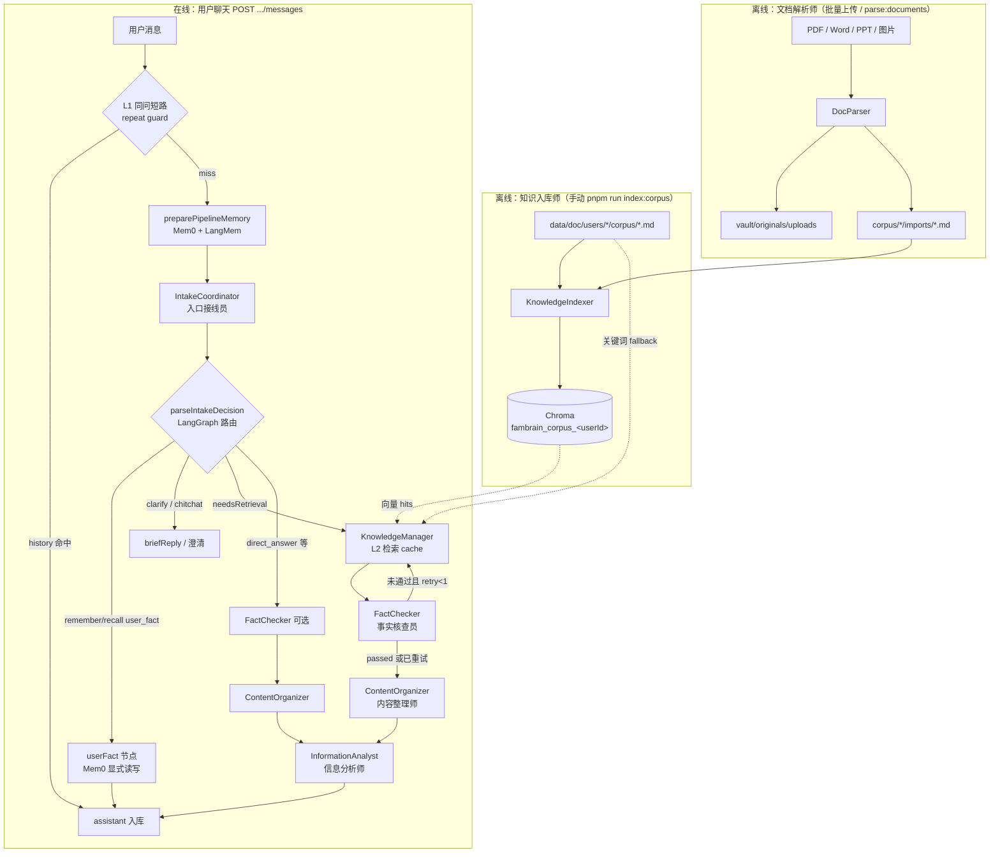

> **进度（2026-06-02）：** 离线 `KnowledgeIndexer` ✅；在线 KM 向量 + 关键词 fallback；D5～D6 入图；**D7 DocParser**、**D8 Mem0/LangMem**、**D9 ContentSummarizer**（离线摘要）；**MCP / Recall / Vercel AI** 见 [experiments/README.md](../experiments/README.md)。在线 Agent JSON 均走 Zod。

## P0 在线编排流程

入口接线员只输出 **JSON 路由决策**；**进哪个节点由 LangGraph 查表决定**（`IntakeRoutingDecision` 见 `agentflow/agents/online/intake-coordinator/prompt.ts`），不是模型在回复里写「下一个 Agent 名字」。

实现：`apps/agents/src/agentflow/pipeline/graph/compile.ts` · 流式入口 `pipeline/graph/stream.ts` → `runPipelineStream()`。

**D5-2 / P0-15 三层 cache（2026-06 · env 可关）：**

| 层 | 位置 | Key / 条件 | 命中后 | 关闭 |
|----|------|------------|--------|------|
| **L1 同问短路** | `stream.ts` + `intakeNode` | `normalize(userQuestion)` + history 中已有 assistant 答 | 只 emit `intake`，复用上轮答案（`repeatQuestionHit`） | `REPEAT_QUESTION_CACHE_DISABLED=1` |
| **L2 检索 cache** | `retrievalNode` | `{prefix}:retrieval:v1:{corpusUserId}:{queryType}:{normalize(searchQuery)}` | 跳过 KM；仍走 FC / Analyst（`retrievalCacheHit`） | `RETRIEVAL_CACHE_DISABLED=1` |
| **L3 facet 终稿** | `composite-answer-cache.ts` | 同会话 `conversationId` + `corpusUserId` + **facetKey** | composite/slot 增量：命中槽跳过 KM；**slot 单槽**时 Analyst 读 L3 或 citations 还原 hits | `COMPOSITE_ANSWER_CACHE_DISABLED=1` |

清空 Redis / memory：`pnpm --filter @fambrain/agents exec tsx --env-file=../../.env scripts/clear-pipeline-cache.ts`（改 env 后须**重启 agents** 清进程内 memory）。

L1 解决 Intake 非确定性导致「同句再问 searchQuery 变、公司数降级」；L2 解决问法不同但 Intake 产出相同 `searchQuery` 的场景（如 eval `CACHE-G4-repeat`）。

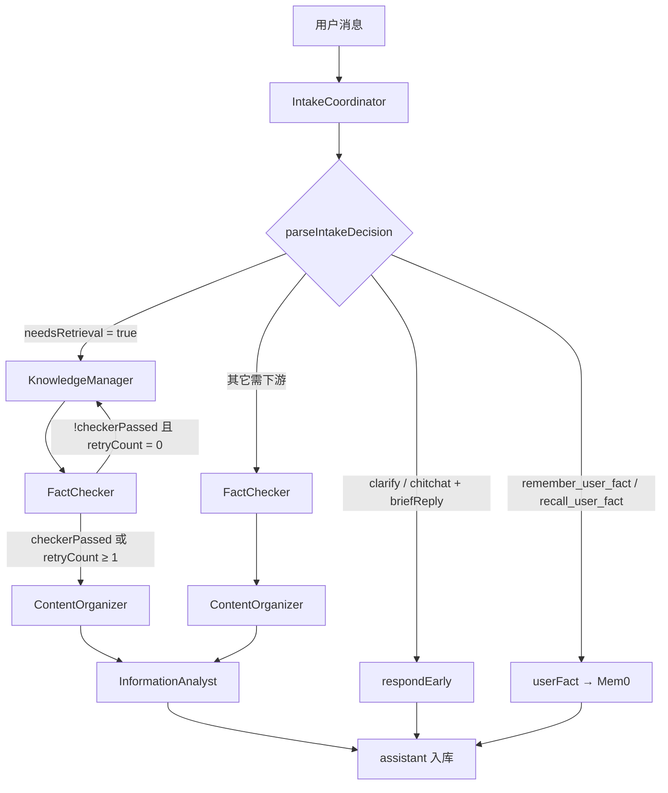

## 单 Agent 实现流程

每个 Agent 一张图 + 步骤表（**规则 / 文件 / 方法**），便于对照代码。

### 1. KnowledgeIndexer — 知识入库师 ✅

**触发：** 手动 `pnpm run index:corpus`（语料 md 变更、换 embed 模型、改分块规则后重跑）。**不参与**用户聊天实时链路。

**技术：** LlamaIndex、ChromaDB、Ollama Embed、Zod（metadata）、Pino。

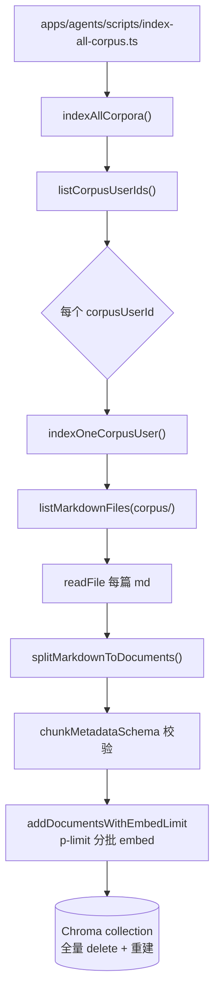

| 步骤 | 做什么 | 规则 | 文件 | 方法 |
|------|--------|------|------|------|
| 0 | CLI 入口 | 加载 `.env`；失败 exit 1 | `apps/agents/scripts/index-all-corpus.ts` | — |
| 1 | 找用户 | `data/doc/users/*` 下 corpus 至少有 1 个 `.md` | `list-corpus-users.ts` | `listCorpusUserIds()` |
| 2 | 路径约定 | 语料根 `users/<id>/corpus/` | `apps/agents/src/knowledge/doc-paths.ts` | `getUserCorpusRoot()` |
| 3 | 扫 md | 递归 `.md`；跳过 `vault/originals/images/...` | `list-markdown-files.ts` | `listMarkdownFiles()`, `toRepoPath()` |
| 4 | 读正文 | UTF-8 读全文 | `index-one-user.ts` | `readFile()` |
| 5 | 分块 | 按 `##` 切；无 `##` 整篇 1 块；`id_`=user:path:index | `split-markdown.ts` | `splitMarkdownToDocuments()` |
| 6 | metadata | path / title / chunkIndex / corpusUserId | `chunk-metadata.ts` | `chunkMetadataSchema.parse()` |
| 7 | embed | `OLLAMA_MODEL_EMBED`（默认 nomic-embed-text）；**p-limit** 限制并发批次数 | `embed-batches.ts`, `index-one-user.ts` | `addDocumentsWithEmbedLimit()`, `getEmbedIndexOptions()` |
| 8 | 存 Chroma | collection=`fambrain_corpus_<userId>`；**先删后建**（全量幂等） | `index-one-user.ts`, `constants.ts` | `ChromaVectorStore`, `getChromaServerUrl()` |
| 9 | 日志 | JSON 结构化 | `index.ts` | `indexerLogger`（pino） |

**前置：** 终端 1 `pnpm run chroma:server`；Ollama 可访问且已 pull embed 模型。

### 2. IntakeCoordinator — 入口接线员 ✅

**职责：** 只产 **路由 JSON**，不写终稿、不检索。

**技术：** LangChain `ChatOllama`、`SystemMessage` / `HumanMessage`；输出 **Zod**（`intakeRoutingSchema`）。

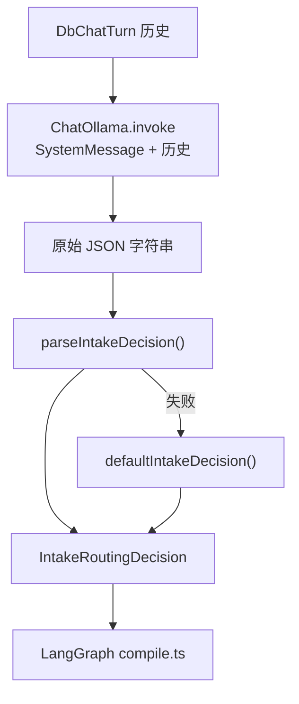

| 步骤 | 做什么 | 规则 | 文件 | 方法 |
|------|--------|------|------|------|
| 1 | 拼 prompt | 系统指令定义 intent / searchQuery 等 | `IntakeCoordinator/prompt.ts` | `prompt` |
| 2 | 调模型 | 一次 `invoke`；模型见 `OLLAMA_MODEL_INTAKE_COORDINATOR` | `IntakeCoordinator/ollama-chat.ts` | `completeIntakeCoordinator()` |
| 3 | 解析 JSON | 抠 JSON → **Zod parse**；`userFact*` 缺省视为 `null`（勿误 fallback 检索） | `parse-intake.ts`, `schema.ts` | `parseIntakeDecision()`, `intakeRoutingSchema` |
| 4 | 兜底 | 解析失败 → `needsRetrieval=true` 保守查库（Golden G1 曾因缺字段触发） | `pipeline/parse-intake.ts` | `defaultIntakeDecision()` |
| 5 | 编排 | LangGraph 条件边 | `pipeline/graph/compile.ts` | `getCompiledPipelineGraph()` |

**Guard 链（compile intake 节点内）：** **coreference**（无上下文指代 → clarify；有上文 → `enrichSearchQueryFromHistory` 补全 searchQuery，如 G5b 城管）→ chitchat → **retrievalPlan guard** → **`routeUserFactFromIntake`**（P0-16，优先于 composite）→ **`applyCompositeRouteGuard`**（P0-15）。详见 [坑点 §2.5.3](./04-pitfalls.md#253-p0-15--r6-3--composite-分槽检索-2026-06) · [§2.5.6 Golden](./04-pitfalls.md#256-golden-回归-g1gmem--2026-06) · [§2.6 userFact](./04-pitfalls.md#26-跨会话用户自述事实未召回2026-06--web-联调)。

### 2.5 跨会话用户事实 userFact — P0-16 ✅

**职责：** 用户自述联系方式/账号（QQ、手机、邮箱、微信等）的 **记住** 与 **跨 conversationId 召回**；不经 KM / FactChecker / Analyst，直接读写 Mem0。

**设计要点：**

| 层 | 模块 | 行为 |
|----|------|------|
| **Intake schema** | `prompt.ts` + `schema.ts` | `intent`: `remember_user_fact` / `recall_user_fact`；字段 `userFactKey` / `userFactLabel` / `userFactValue` |
| **路由** | `user-fact.ts` → `intake-user-fact-guard.ts` | `routeUserFactFromIntake()` 从 JSON 解析；**不靠问句 regex 词表** |
| **编排** | `compile.ts` | Intake 后 `decision.userFact` 存在 → **userFact 节点** → END |
| **Mem0** | `mem0/store.ts` | `addStructuredUserFact()` 写入；`searchUserFactMemories(factKey, label, question)` 语义检索 |
| **值提取** | `user-fact.ts` | `extractByFactKey` + `validateFactValueForKey`；Mem0 行如 `QQ号是734858469` 须提取完整号码（勿误切「码」） |

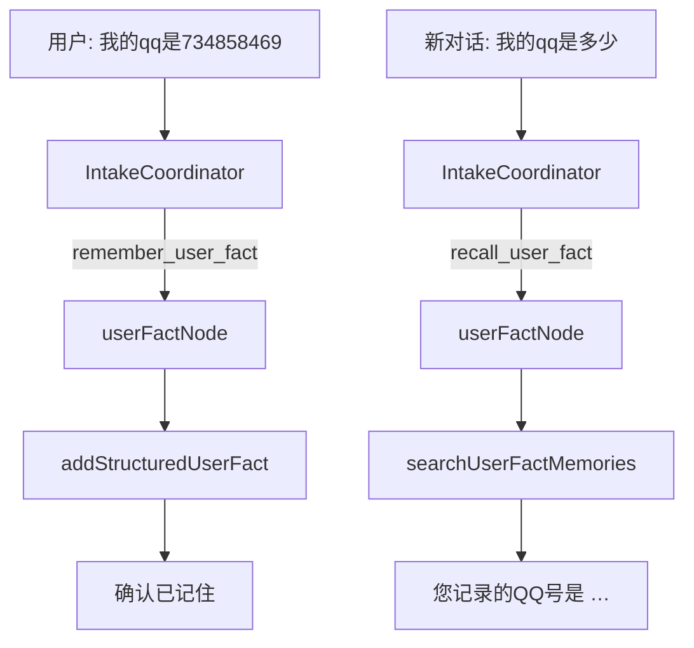

| 步骤 | 做什么 | 文件 | 方法 |
|------|--------|------|------|
| 1 | Intake 产出 schema | `intake-coordinator/prompt.ts` | `remember_user_fact` / `recall_user_fact` 示例 |
| 2 | 解析路由 | `user-fact.ts` | `routeUserFactFromIntake()`、`findUserFactValueInTexts()` |
| 3 | 写入 / 召回 | `user-fact-node.ts` | `userFactNode()` → Mem0 |
| 4 | SSE | `stream.ts` | step `user_fact` |

**验证：** `pnpm --filter @fambrain/agents run verify:user-fact`（跨 conversationId A 记 → B 问）。**改 agents 代码后须重启服务**；与 L1/L2/L3 检索 cache 无关。

### 3. KnowledgeManager — 知识管理员 ✅

**职责：** 产出 `hits[]`（path / excerpt / relevance），不对用户说话。

**技术：** **纯规则精排**（无 LLM）。**Hybrid 并行召回**（Chroma 向量 ∥ corpus BM25）→ RRF 融合 → `tokenize` + `pickExcerpt` 确定性输出。与业界「检索层不用 Chat LLM、生成留给 Analyst」一致；避免小模型在精排阶段改写 excerpt、编造 `notes`（见 [坑点 P0-4 / D3-3](./04-pitfalls.md)）。

> **v3 进度（Wave A）：** … Wave A 规则层收尾完成。  
> **Wave B：** HY-01～07 ✅ 并行 Hybrid + RRF 已接入 KM 主链  
> **Wave C：** QU-01～06 ✅ Intake `queryType` + 多轮指代补全（`verify:intake-coreference`）  
> **Wave D：** EV-01～07 ✅ `confidenceTier` 分档 + FC 高置信规则快检（`tier_skip_llm`）

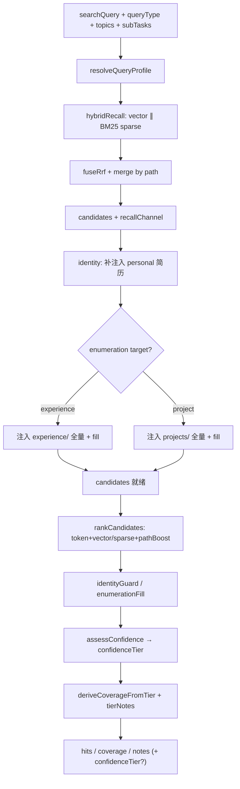

| 步骤 | 做什么 | 规则 | 文件 | 方法 |
|------|--------|------|------|------|
| 1 | Hybrid 召回 | 向量 + BM25 **并行**；RRF 融合；topK 按 profile | `hybrid-recall.ts`、`fusion-rrf.ts` | `hybridRecall()` |
| 2 | 关键词扫盘 | ~~向量空或低置信时扫三目录~~ **已移除**（由 BM25 sparse 替代） | — | — |
| 3 | 规则精排 | **token + vector + pathBoost**；`pickExcerpt`（表格行优先） | `retrieve-helpers.ts` | `rankCandidates()`、`pickTableExcerpt()` |
| 4 | identity / 列举保底 | identity 补注入 personal + Top1；**enumeration 按 target**：`experience` → experience fill；`project` → projects fill（`resolveEnumerationTarget`） | `retrieve.ts`、`enumeration-target.ts`、`retrieve-helpers.ts` | `ensureIdentityPersonalCandidate()`、`ensureEnumerationExperienceCandidates()`、`ensureEnumerationProjectCandidates()`、`applyEnumerationFill(..., target)` |
| 5 | 兜底 | **低置信**才 `ensureNonEmptyHits`；高/中置信不硬塞 Top1 | `retrieve.ts`、`score-candidate.ts` | `shouldCoalesceEmptyHits()`、`ensureNonEmptyHits()` |
| 6 | 置信分档 | 融合分 + gap + path 权威 → `high` / `mid` / `low` | `score-candidate.ts` | `assessConfidence()`、`deriveCoverageFromTier()` |
| 7 | 输出 | **maxHits 按 profile**；列举型 notes 标明覆盖段数；可选 `confidenceTier` | `types.ts` | `KnowledgeRetrievalResult` |

### 4. FactChecker — 事实核查员（D5）✅

**职责：** 审查当轮 `hits` / `coverage` 是否足以回答 `userQuestion`；**不写终稿**。`passed=false` 时产出 `refinedSearchQuery`，编排器最多再打回 KM **1 次**。

**技术：** LangChain `ChatOllama`；**Wave D**：`confidenceTier=high` 时规则快检跳过 LLM（`tier_skip_llm`）；规则兜底 `buildRuleBasedFactCheck()`；输出 **Zod**（`factCheckerResultSchema`）；`retryCount≥1` 时代码强制放行。

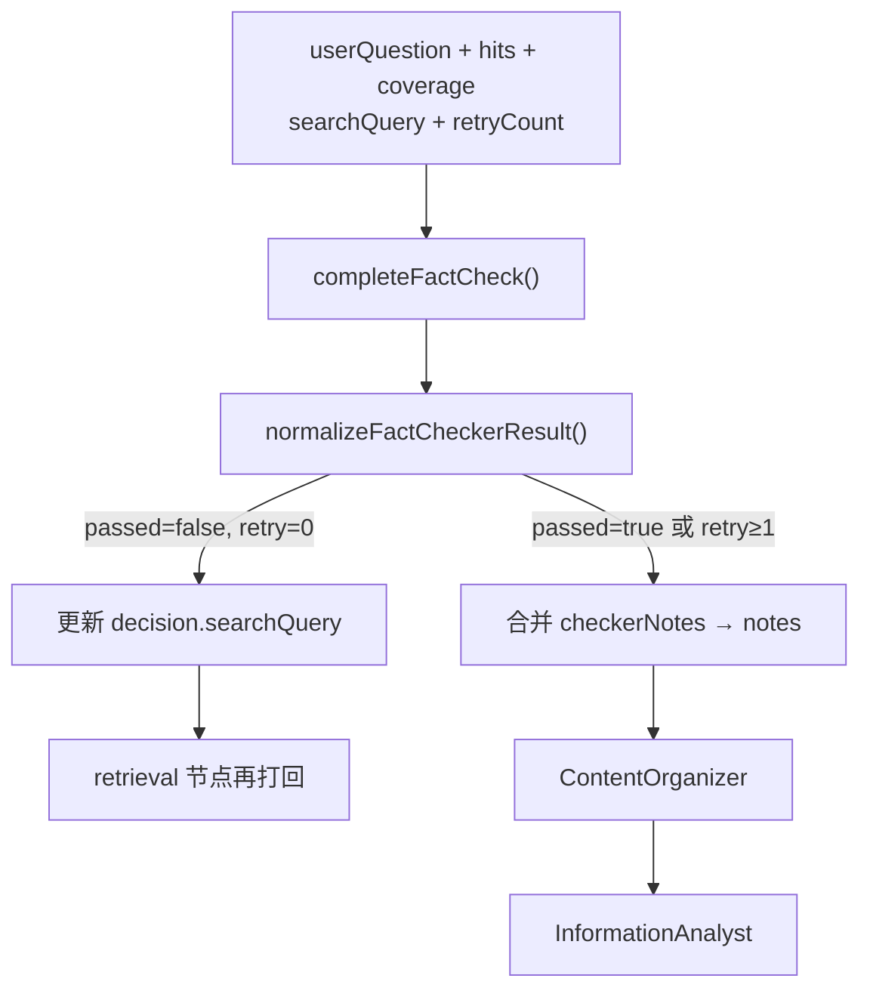

| 步骤 | 做什么 | 规则 | 文件 | 方法 |
|------|--------|------|------|------|
| 1 | 输入 | 含 `retryCount`（0=首次，1=已重试） | `fact-checker/prompt.ts` | `FactCheckerInput` |
| 2 | 调模型 | 与 Intake 同 `OLLAMA_MODEL_INTAKE_COORDINATOR` | `check-facts.ts` | `completeFactCheck()` |
| 3 | 解析 | JSON → **Zod** → `passed` / `evidenceScore` / `issues` | `check-helpers.ts`, `schema.ts` | `normalizeFactCheckerResult()` |
| 4 | 兜底 | LLM 失败走规则；重试后强制 `passed=true` | `check-helpers.ts` | `buildRuleBasedFactCheck()` |
| 5 | 编排 | `checkerPassed` → contentOrganizer 或 retrieval | `pipeline/graph/compile.ts` | `factCheckerNode()`, `routeAfterFactChecker()` |

**验证：** `pnpm run verify:fact-checker`（规则）、`pnpm run verify:fact-checker:pipeline`（轻量冒烟）、`pnpm run golden:regression`（G1～G5 标准回归）。同句再问走 L1 repeat guard 或 L2 检索 cache，见 [坑点 §2.2](./04-pitfalls.md)。

### 5. InformationAnalyst — 信息分析师 ✅

**职责：** 据整理后的 `hits` 写终稿；无证据时 `insufficientEvidence`，禁止编造履历。

**P0-12（2026-06-18）：** `hits.length===0` 或 `coverage==="none"` 时 **`shouldSkipAnalystLlm`** 不调 Ollama，直出 `buildFallbackAnswer`（日志 `rules_empty_hits_skip_llm`）。年龄/姓名单问空 hits 有字段化文案（2026-06）。**P0-18（2026-06）：** slot + L3 命中时不再误走空 hits 兜底，见 [坑点 §2.5.4](./04-pitfalls.md#254-单问年龄--多轮-cache-p0-18--2026-06)。

**P0-15 composite（2026-06）：** `routeMode=composite` 且 ≥2 槽 → **`stream-composite.ts`** 顺序分问 token 流式；L3 facet cache 命中 instant 回放；新 facet 写回 `composite-answer-cache`。composite ≥2 槽跳过 FactChecker LLM。

**P0-19 / P0-20（2026-06）：** 单问 `identity` / `enumeration` / `default` 走 **plain-text 流式**（与 composite 子问同路径，`think: false`），避免 JSON 解析失败退回「根据知识库摘录」体；hits 上限与 KM **queryProfile** 对齐（`analyst-recall-limits.ts`）；ContentOrganizer 按 profile 设 `maxHits`。详见 [坑点 §2.5.5](./04-pitfalls.md#255-analyst-纯文本流--enumeration-项目公司分流-p0-19--p0-20--2026-06)。

**技术：** composite / 单问列举 → **plain-text 流式**；`tech` 单问仍 JSON **Zod**；fallback 为紧凑列表（非 raw excerpt 粘贴）。

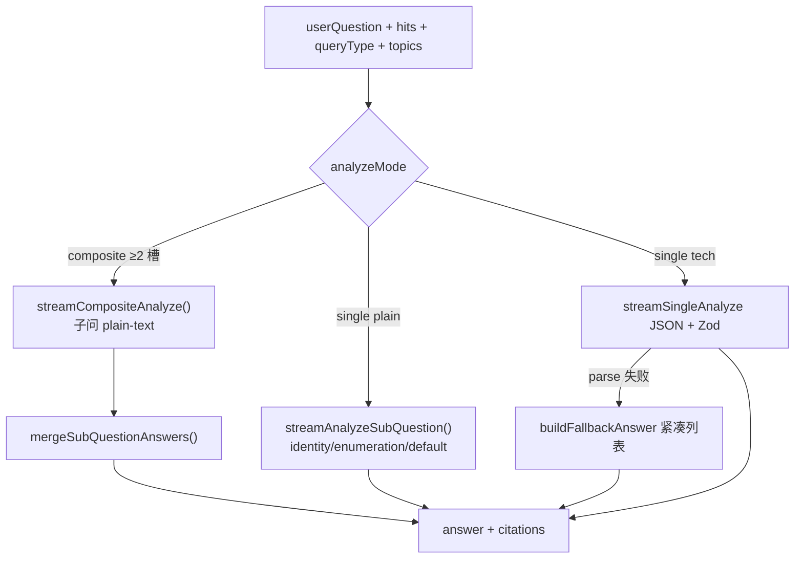

| 步骤 | 做什么 | 规则 | 文件 | 方法 |
|------|--------|------|------|------|
| 1 | 输入 | hits + **queryType** / **topics**（来自 Intake） | `InformationAnalyst/prompt.ts` | `InformationAnalystInput` |
| 2 | 空 hits 短路 | **P0-12** 不调 LLM | `analyze-helpers.ts` | `shouldSkipAnalystLlm()` |
| 3 | profile 上限 | enumeration **8** / identity **4**（非固定 4） | `analyst-recall-limits.ts` | `maxAnalystHitsForProfile()` |
| 4 | 流式 | composite + 单问列举 → plain-text；tech → JSON | `stream.ts`, `complete-analyze.ts` | `streamAnalyzeInformation()`, `streamAnalyzeSubQuestion()` |
| 5 | 子问 prompt | **project** topics：只列 projects/ 项目名，禁止答公司 | `sub-question-prompt.ts` | `buildSubQuestionStreamPrompt(profile, topics)` |
| 6 | fallback | 紧凑 bullet 列表，非「根据知识库摘录」 | `analyze-helpers.ts` | `buildFallbackAnswer()`, `formatHitsAsAnswerList()` |
| 7 | 落库 | LangGraph `analyst` 节点 + SSE custom 流 | `pipeline/graph/compile.ts`, `stream.ts` | `analystNode()`, `streamAnalyzeInformation()` |

### 6. ContentOrganizer — 内容整理师（D6）✅

**职责：** 在 FactChecker 放行后、Analyst 生成前，对 `hits` 做 **Zod 规范化**、**同 path 去重**、excerpt 合并；空 hits 时将 `coverage` 降为 `none`。**不调 LLM**。

**技术：** Zod（`knowledgeHitsSchema`）；规则合并（`organizeHits` / `dedupeCitations`）；**maxHits 随 queryProfile**（enumeration **8**，default **5**）。

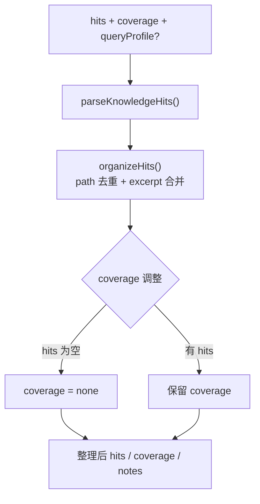

| 步骤 | 做什么 | 规则 | 文件 | 方法 |
|------|--------|------|------|------|
| 1 | 输入 | 上游 KM + FactChecker 的 `hits` / `coverage` / `notes` | `content-organizer/prompt.ts` | `ContentOrganizerInput` |
| 2 | Zod 校验 | 丢弃非法 hit 字段 | `content-organizer/schema.ts` | `parseKnowledgeHits()` |
| 3 | path 去重 | 同 path 保留最高 relevance；excerpt 合并（≤320 字） | `organize-hits.ts` | `organizeHits()`, `normalizeDocPath()` |
| 4 | coverage | hits 为空 → `none` | `organize-knowledge.ts` | `organizeKnowledge()` |
| 5 | 编排 | FactChecker 后固定进入 | `pipeline/graph/compile.ts` | `contentOrganizerNode()` |

**验证：** `pnpm run verify:content-organizer`；全 Agent schema：`pnpm run verify:agent-schemas`。

### 7. DocParser — 文档解析师（D7）✅

**触发：**

- **Web**：`/corpus` 语料导入页（拖放 / 选文件 / 选文件夹）或对话输入框 **+** 附件；`POST /api/documents/upload` → Agents `POST /documents/upload`
- **CLI**：`pnpm run parse:documents -- <path...>`（**无需 userId**；语料归属见 `.env` `FAMBRAIN_CORPUS_USER_ID` 或 `data/doc/users/`）

**不参与**在线聊天问答实时链路（上传后可选重建 Chroma，再被 KM 检索）。

**职责：** 批量接收 PDF / Word / PPT / 图片 → 解析为 Markdown → 原件存 `vault/originals/uploads` → **按文件自动分类**写入 `corpus/<personal|projects|experience>/imports/` → 可选 `indexOneCorpusUser()`。用户只见摘要：「已导入 N 个文件：个人 X · 项目 Y · 经历 Z，向量库已更新」。

**分类：** `resolveCorpusCategory()` — 路径含 `personal/projects/experience` 优先；否则按文件名 / 标题 / 正文关键词推断；默认 `personal`。CLI `--category` 可整批强制覆盖。

**技术：** pdf-parse、officeparser、mammoth（docx）、Ollama vision OCR（图片）、p-limit 并发、Zod（结果 schema）、Pino。

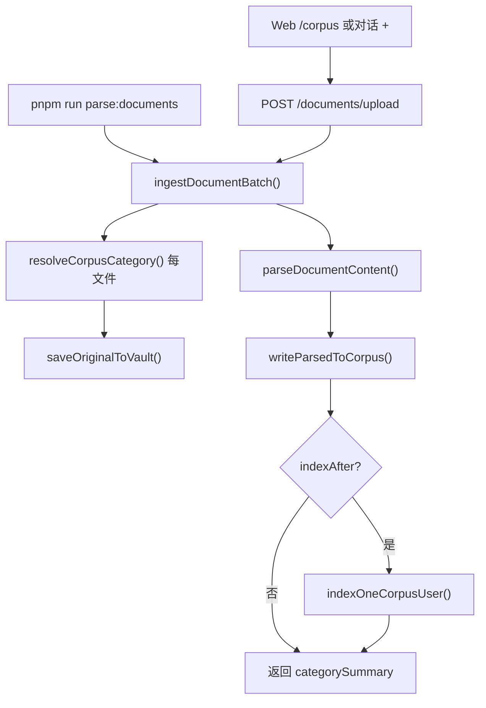

| 步骤 | 做什么 | 规则 | 文件 | 方法 |
|------|--------|------|------|------|
| 0 | HTTP / CLI | JWT 鉴权（Web）；CLI 自动 `resolveDefaultIngestIdentity()` | `documents-upload.ts`, `parse-documents.ts` | `handleDocumentsUpload()` |
| 1 | 分类 | 每文件独立；可选 `relativePaths`（文件夹上传） | `resolve-corpus-category.ts` | `resolveCorpusCategory()` |
| 2 | 存原件 | `users/<actor>/vault/originals/uploads/` | `write-corpus-md.ts` | `saveOriginalToVault()` |
| 3 | 解析 | PDF→pdf-parse；Word→mammoth/docx+officeparser；PPT→officeparser；图片→Ollama OCR | `parse-file.ts`, `parse-image-ocr.ts` | `parseDocumentContent()` |
| 4 | 写 md | `corpus/<category>/imports/` | `write-corpus-md.ts` | `writeParsedToCorpus()` |
| 5 | 入库 | 默认 `indexAfter=true`；Web 大批量客户端分批，末批才 index | `ingest-batch.ts` | `ingestDocumentBatch()` |
| 6 | 并发 | `DOC_PARSE_CONCURRENCY`（默认 2） | `ingest-batch.ts` | `getDocParseConcurrency()` |

**验证：** `pnpm run verify:doc-parser`（格式 / 路径 / 分类单测，不依赖 Ollama）。

### 8. 记忆层 — Mem0 + LangMem（D8）✅

**触发：** 每轮 `runPipelineStream` 开始前（`pipeline/graph/stream.ts`）。**不参与**离线入库链路。

**职责：** **Mem0** 按 `actorUserId` 检索跨会话偏好/事实；**LangMem** 按 `conversationId` 维护会话摘要；合并为 `memoryBlock` 注入 **IntakeCoordinator** 与 **InformationAnalyst** prompt。轮次结束后 `persistTurnMemory` 写回 Mem0 与 LangMem 存储。

**P0-16 补充：** 联系方式类 **remember/recall** 走 **userFact 节点**（`addStructuredUserFact` / `searchUserFactMemories`），不依赖轮次后 LLM 抽取；LangMem 仍仅本会话。

**存储：** `data/memory/mem0/history.db`（Mem0 SQLite）、`data/memory/sessions/<conversationId>.json`（LangMem）。BFF 请求体须带 `conversationId`（`packages/agent-types`）。

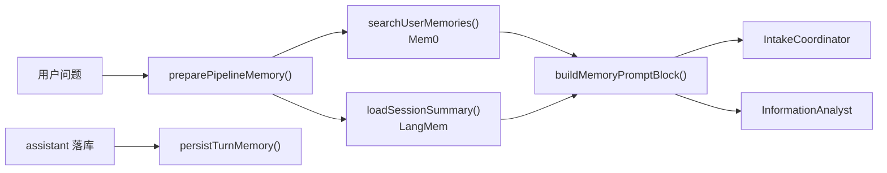

| 步骤 | 做什么 | 配置 | 文件 | 方法 |
|------|--------|------|------|------|
| 0 | 开关 | `MEM0_ENABLED` / `LANGMEM_ENABLED`（默认开） | `memory/config.ts` | `getMemoryConfig()` |
| 1 | 加载 | 检索 Mem0 + 读会话摘要；裁剪 Intake 历史 | `prepare-context.ts` | `preparePipelineMemory()` |
| 2 | 注入 | `memoryBlock` 拼入 system/human | `build-prompt-block.ts` | `buildMemoryPromptBlock()` |
| 3 | 持久化 | 本轮 user/assistant 写入 Mem0；满 N 轮触发 LangMem 摘要 | `persist-turn.ts`, `langmem-session.ts` | `persistTurnMemory()` |

**验证：** `pnpm run verify:memory`（需 Ollama；可 `MEM0_ENABLED=false` 仅测 LangMem）。

### 9. ContentSummarizer — 内容摘要师（D9）✅

**触发：**

1. **在线（主路径）**：Intake 判定 `intent === "summarize_content"` → 可选 KM 检索 → **ContentSummarizer** → 终稿（不经 Analyst）。
2. **CLI**：`pnpm run summarize:document -- <file.md>`（单文件工具，不经过 Intake）。

**职责：** 对检索片段或用户原文生成结构化摘要，格式化为 Markdown 回复（`title` / `summary` / `bullets` / `keywords`）。

| 步骤 | 做什么 | 文件 | 方法 |
|------|--------|------|------|
| 1 | 截断正文（≤12k 字） | `summarize.ts` | `summarizeContent()` |
| 2 | Ollama + Zod | `schema.ts`, `prompt.ts` | `parseContentSummaryResult()` |
| 3 | 读文件 | `summarize-file.ts` | `summarizeMarkdownFile()` |
| 4 | 编排 | `compile.ts` | `contentSummarizerNode()`；`buildSummarizeSourceText()` |
| 5 | 展示 | `format-answer.ts` | `formatSummaryAsAnswer()` |

**在线分支（`compile.ts`）：**

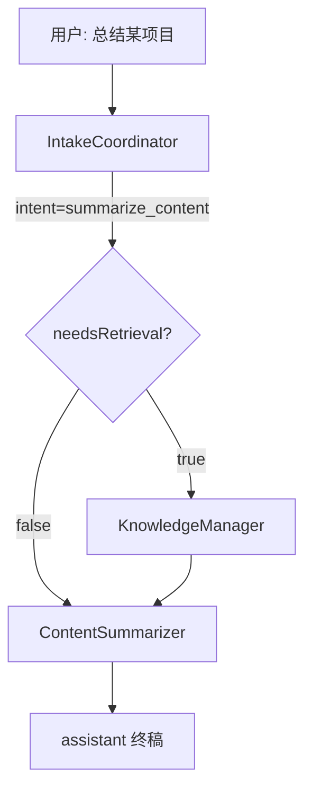

**验证：** `pnpm run verify:content-summarizer`；`verify:agent-schemas`（含 `summarize_content` intent）；CLI 需 Ollama。

### 10. 实验触达 — MCP / Recall / Vercel AI ✅

与主链解耦，脚本在 `apps/agents/scripts/experiments/`，说明见 [experiments/README.md](../experiments/README.md)。

| 实验 | 命令 | 作用 |
|------|------|------|
| MCP 列 vault | `pnpm run experiment:mcp-vault` | stdio MCP 工具 `list_vault_files` |
| Recall 对比 | `pnpm run experiment:recall-compare -- <userId> "query"` | BM25 sparse vs `searchCorpusVectors` |
| Sparse / Hybrid 自测 | `pnpm run verify:sparse-recall` / `verify:hybrid-recall` / `verify:recall-compare` | HY-01～07 |
| Vercel AI SDK | `pnpm run experiment:vercel-ai -- "prompt"` | `streamText` + Ollama（主链仍自研 SSE） |

**验证：** `pnpm run verify:vault-list`（vault 列举单测）。

## 路由字段（IntakeCoordinator 输出）

| 英文字段 | 中文名 | 含义 | 典型去向 |
|----------|--------|------|----------|
| `intent` | 意图类型 | 查库回答 / 直接答 / 澄清 / 闲聊 / 拒答 | 编排器分支 |
| `needsRetrieval` | 是否需要检索 | `true` 时必须走知识管理员 | → KnowledgeManager |
| `searchQuery` | 检索查询句 | 去掉寒暄后的检索关键词句 | → KnowledgeManager 入参 |
| `subTasks` | 子任务列表 | 复杂问题拆成多句 | → KM / Analyst |
| `topics` | 主题标签 | 如 `resume`、`aky` | → KnowledgeManager 入参 |
| `language` | 回复语言 | `zh` / `en` / `mixed` | → InformationAnalyst 入参 |
| `confidence` | 置信度 | 0–1，可观测、可降级 | 日志 / 后续策略 |
| `clarifyingQuestion` | 澄清提问 | 信息不足时追问一个关键问题 | **直接返回用户** |
| `briefReply` | 简短回复 | 寒暄或拒答（≤80 字） | **直接返回用户** |
| `userFactKey` | 事实键 | 如 `qq` / `phone` / `email` / `wechat` | → **userFact 节点** |
| `userFactLabel` | 展示标签 | 如「QQ号」 | → userFact 召回文案 |
| `userFactValue` | 事实值 | remember 时必填；recall 时为 `null` | → Mem0 写入 / 校验 |

## 编排分支（`pipeline/graph/compile.ts`）

| 条件 | 节点顺序 | 用户看到什么 |
|------|----------|--------------|
| `intent === "clarify"` 且 `clarifyingQuestion` 有值 | `respondEarly` | 澄清提问 |
| `intent` 为 `chitchat` / `out_of_scope` 且 `briefReply` 有值 | `respondEarly` | 简短回复 |
| `intent === "summarize_content"` 且 `needsRetrieval === true` | KM → **ContentSummarizer** → 终稿 | SSE：检索 → **生成摘要** |
| `intent === "summarize_content"` 且 `needsRetrieval === false` | **ContentSummarizer** → 终稿 | SSE：**生成摘要** |
| `intent` 为 `remember_user_fact` / `recall_user_fact` 且 Intake 填齐 schema | **userFact** → 终稿 | SSE：`user_fact`；**不经 KM / FC / Analyst** |
| `needsRetrieval === true`（非摘要） | KM → **FactChecker** → **ContentOrganizer** →（可选再打回 KM）→ Analyst | SSE：检索 → 核查 → **整理证据** → 整理回答 |
| `needsRetrieval === false` 且无 `briefReply` | FactChecker → **ContentOrganizer** → Analyst（`hits` 常为空） | 不查库长答 |
| FactChecker `passed=false` 且 `retryCount<1` | 再 `retrieval` → 再 **FactChecker** | 同轮可能见两次「核查证据…」 |
| 其余 | `respondEarly` | 简短说明或请用户补充 |

## 流式 SSE 事件（`POST .../messages`）

| `event` | 含义 |
|---------|------|
| `meta` | 用户消息已落库（含真实 `id`） |
| `step` | 编排进度：`intake` / **`user_fact`** / `retrieval` / `fact_checker` / **`content_summarizer`** / **`content_organizer`** / `analyst`，`status` 为 `running` \| `done`；`done` 时可带 `durationMs` |
| `pipeline_timing` | SLO：本轮 `totalMs`、`ttftMs`、各节点 `nodes`（Agents → BFF 转发） |
| `ready` | Pipeline 已出终稿、即将落库（BFF）；前端可提前解锁输入 |
| `thinking` | 信息分析师推理流（若模型/Ollama 支持） |
| `assistant` | 面向用户的正文增量（流结束后以 `answer` 写入 DB） |
| `done` | 流结束，含 user/assistant 消息 id、终稿 `content`、可选 `timing` |
| `error` | 模型或编排失败 |
