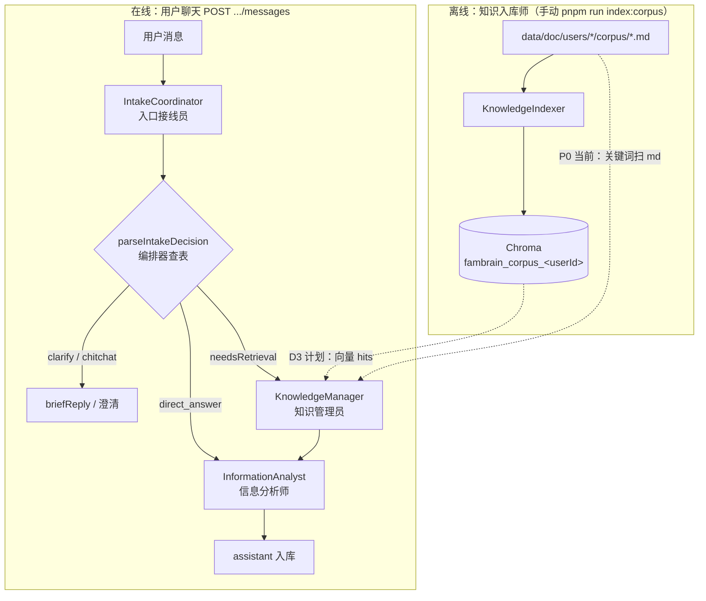
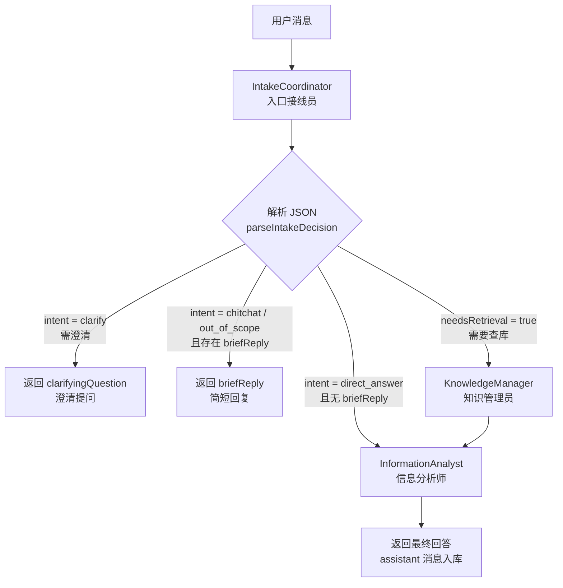
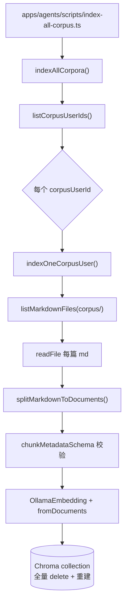
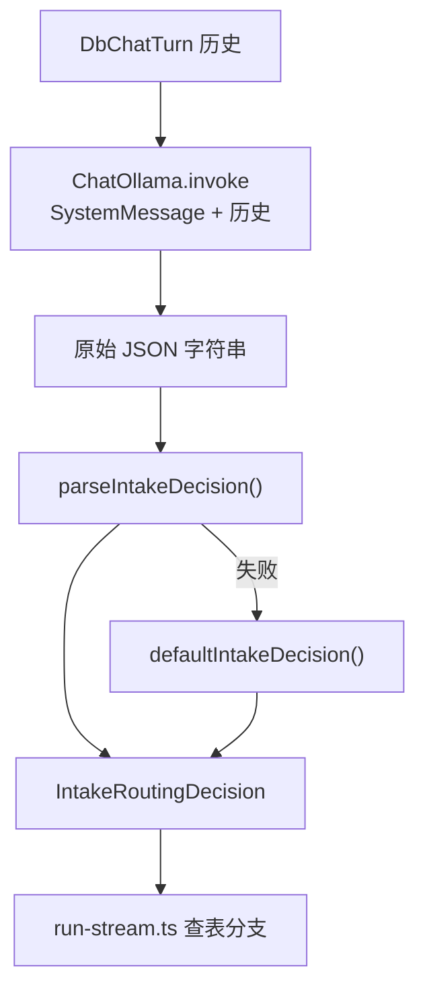
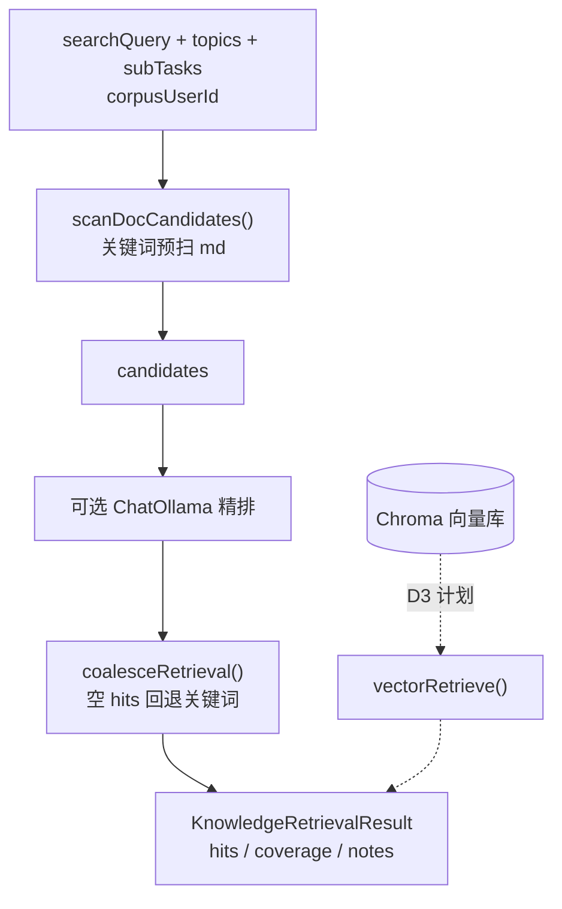
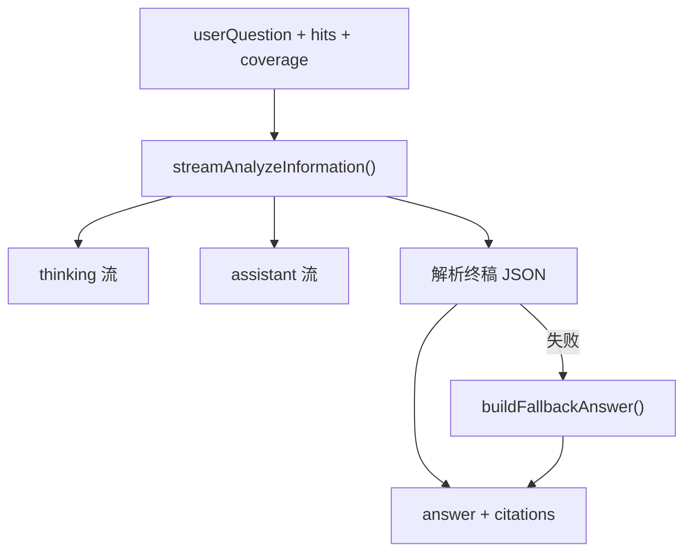

# Agent 流程图

[← 返回 README](../README.md) · [路线图](./03-roadmap.md) · [坑点清单](./04-pitfalls.md)

本文描述 FamBrain 多 Agent 的 **全局链路**、**在线编排**、**单 Agent 实现**（含规则 / 文件 / 方法），以及路由契约与 SSE 事件。

## P0 三 Agent 角色

| 英文名 | 中文名 | 职责 |
|--------|--------|------|
| `IntakeCoordinator` | 入口接线员 | 接收输入、理解意图、拆分任务、分发下游 |
| `KnowledgeManager` | 知识管理员 | 检索知识库，返回相关片段（RAG 检索） |
| `InformationAnalyst` | 信息分析师 | 对检索结果分析、归纳并回答 |

**里程碑：** 用户提问 → 意图识别 → 检索 → 分析 → 回答。（在线三 Agent **已实现**；检索仍为 P0 关键词，向量库已可离线入库，在线向量检索见 D3。）

## 全链路总览（离线入库 + 在线对话）

> **进度（2026-05）：** 离线 `KnowledgeIndexer` ✅（442 chunks 已入库验证）；在线 KM 仍读 md 关键词，下一步 D3 接 Chroma `asRetriever()`。

## P0 在线编排流程

入口接线员只输出 **JSON 路由决策**；**进哪个 Agent 由服务端编排器查表决定**（见 `apps/agents/src/IntakeCoordinator/prompt.ts` 中的 `IntakeRoutingDecision`），不是模型在回复里写「下一个 Agent 名字」。

## 单 Agent 实现流程

每个 Agent 一张图 + 步骤表（**规则 / 文件 / 方法**），便于对照代码。

### 1. KnowledgeIndexer — 知识入库师 ✅

**触发：** 手动 `pnpm run index:corpus`（语料 md 变更、换 embed 模型、改分块规则后重跑）。**不参与**用户聊天实时链路。

**技术：** LlamaIndex、ChromaDB、Ollama Embed、Zod（metadata）、Pino。

| 步骤 | 做什么 | 规则 | 文件 | 方法 |
|------|--------|------|------|------|
| 0 | CLI 入口 | 加载 `.env`；失败 exit 1 | `apps/agents/scripts/index-all-corpus.ts` | — |
| 1 | 找用户 | `data/doc/users/*` 下 corpus 至少有 1 个 `.md` | `list-corpus-users.ts` | `listCorpusUserIds()` |
| 2 | 路径约定 | 语料根 `users/<id>/corpus/` | `apps/agents/src/knowledge/doc-paths.ts` | `getUserCorpusRoot()` |
| 3 | 扫 md | 递归 `.md`；跳过 `vault/originals/images/...` | `list-markdown-files.ts` | `listMarkdownFiles()`, `toRepoPath()` |
| 4 | 读正文 | UTF-8 读全文 | `index-one-user.ts` | `readFile()` |
| 5 | 分块 | 按 `##` 切；无 `##` 整篇 1 块；`id_`=user:path:index | `split-markdown.ts` | `splitMarkdownToDocuments()` |
| 6 | metadata | path / title / chunkIndex / corpusUserId | `chunk-metadata.ts` | `chunkMetadataSchema.parse()` |
| 7 | embed | `OLLAMA_MODEL_EMBED`（默认 nomic-embed-text） | `index-one-user.ts`, `config/index.ts` | `OllamaEmbedding`, `Settings.embedModel` |
| 8 | 存 Chroma | collection=`fambrain_corpus_<userId>`；**先删后建**（全量幂等） | `index-one-user.ts`, `constants.ts` | `ChromaVectorStore`, `VectorStoreIndex.fromDocuments()`, `getChromaServerUrl()` |
| 9 | 日志 | JSON 结构化 | `index.ts` | `indexerLogger`（pino） |

**前置：** 终端 1 `pnpm run chroma:server`；Ollama 可访问且已 pull embed 模型。

### 2. IntakeCoordinator — 入口接线员 ✅

**职责：** 只产 **路由 JSON**，不写终稿、不检索。

**技术：** LangChain `ChatOllama`、`SystemMessage` / `HumanMessage`。

| 步骤 | 做什么 | 规则 | 文件 | 方法 |
|------|--------|------|------|------|
| 1 | 拼 prompt | 系统指令定义 intent / searchQuery 等 | `IntakeCoordinator/prompt.ts` | `prompt` |
| 2 | 调模型 | 一次 `invoke`；模型见 `OLLAMA_MODEL_INTAKE_COORDINATOR` | `IntakeCoordinator/ollama-chat.ts` | `completeIntakeCoordinator()` |
| 3 | 解析 JSON | 抠 JSON；失败不抛给用户 | `pipeline/parse-intake.ts` | `parseIntakeDecision()` |
| 4 | 兜底 | 解析失败 → `needsRetrieval=true` 保守查库 | `pipeline/parse-intake.ts` | `defaultIntakeDecision()` |
| 5 | 编排 | **代码**决定 clarify / brief / KM / Analyst | `pipeline/run-stream.ts` | `runPipelineStream()` |

### 3. KnowledgeManager — 知识管理员 ✅ P0 / ⬜ D3 向量

**职责：** 产出 `hits[]`（path / excerpt / relevance），不对用户说话。

**技术：** LangChain `ChatOllama`（精排）；P0 关键词扫描；D3 计划 LlamaIndex `asRetriever()`。

| 步骤 | 做什么 | 规则 | 文件 | 方法 |
|------|--------|------|------|------|
| 1 | 预扫 | `experience/projects/personal`；token 含中文二元切分 | `KnowledgeManager/retrieve.ts` | `scanDocCandidates()`, `tokenize()` |
| 2 | LLM 精排 | 只从 candidates 选；至少 1 条 hit（prompt） | `retrieve.ts`, `prompt.ts` | `retrieveKnowledge()` |
| 3 | 回退 | LLM 返回空 hits → 关键词命中合并 | `retrieve.ts` | `coalesceRetrieval()` |
| 4 | 输出 | 最多 5 条；coverage=sufficient/partial/none | `KnowledgeManager/prompt.ts` | 类型 `KnowledgeHit`, `KnowledgeRetrievalResult` |
| 5 | 向量检索 | **未接**；D3：`asRetriever()` + 关键词 fallback | （待建） | — |

### 4. InformationAnalyst — 信息分析师 ✅

**职责：** 据 `hits` 写终稿；无证据时 `insufficientEvidence`，禁止编造履历。

**技术：** Ollama 流式（thinking + assistant）；终稿 JSON 解析。

| 步骤 | 做什么 | 规则 | 文件 | 方法 |
|------|--------|------|------|------|
| 1 | 输入 | 只认上游 hits；不自己检索 | `InformationAnalyst/prompt.ts` | `InformationAnalystInput` |
| 2 | 流式 | thinking + assistant SSE | `InformationAnalyst/stream.ts` | `streamAnalyzeInformation()` |
| 3 | 终稿 JSON | answer / citations / insufficientEvidence | `InformationAnalyst/analyze.ts` | JSON 解析 |
| 4 | 兜底 | 解析失败用 hits 拼可读回答 | `analyze-helpers.ts` | `buildFallbackAnswer()` |
| 5 | 落库 | 编排器只存最终 assistant 正文 | `pipeline/run-stream.ts` | `runAnalystStream()` |

## 路由字段（IntakeCoordinator 输出）

| 英文字段 | 中文名 | 含义 | 典型去向 |
|----------|--------|------|----------|
| `intent` | 意图类型 | 查库回答 / 直接答 / 澄清 / 闲聊 / 拒答 | 编排器分支 |
| `needsRetrieval` | 是否需要检索 | `true` 时必须走知识管理员 | → KnowledgeManager |
| `searchQuery` | 检索查询句 | 去掉寒暄后的检索关键词句 | → KnowledgeManager 入参 |
| `subTasks` | 子任务列表 | 复杂问题拆成多句 | → KM / Analyst |
| `topics` | 主题标签 | 如 `resume`、`aky` | → KnowledgeManager 入参 |
| `language` | 回复语言 | `zh` / `en` / `mixed` | → InformationAnalyst 入参 |
| `confidence` | 置信度 | 0–1，可观测、可降级 | 日志 / 后续策略 |
| `clarifyingQuestion` | 澄清提问 | 信息不足时追问一个关键问题 | **直接返回用户** |
| `briefReply` | 简短回复 | 寒暄或拒答（≤80 字） | **直接返回用户** |

## 编排分支（`apps/agents/src/pipeline/run-stream.ts`）

| 条件 | 调用的 Agent | 用户看到什么 |
|------|----------------|--------------|
| `intent === "clarify"` 且 `clarifyingQuestion` 有值 | 无（结束） | 澄清提问 |
| `intent` 为 `chitchat` / `out_of_scope` 且 `briefReply` 有值 | 无（结束） | 简短回复 |
| `needsRetrieval === true` | KnowledgeManager → InformationAnalyst | 归纳后的最终回答 |
| `needsRetrieval === false` 且无 `briefReply` | InformationAnalyst（`hits` 为空） | 不查库的通用长答 |
| 其余 | 优先 `briefReply`，否则兜底提示 | 简短说明或请用户补充 |

## 流式 SSE 事件（`POST .../messages`）

| `event` | 含义 |
|---------|------|
| `meta` | 用户消息已落库（含真实 `id`） |
| `step` | 编排进度：`intake` / `retrieval` / `analyst`，`status` 为 `running` \| `done` |
| `thinking` | 信息分析师推理流（若模型/Ollama 支持） |
| `assistant` | 面向用户的正文增量（流结束后以 `answer` 写入 DB） |
| `done` | 流结束，含 user/assistant 消息 id 与终稿 `content` |
| `error` | 模型或编排失败 |
