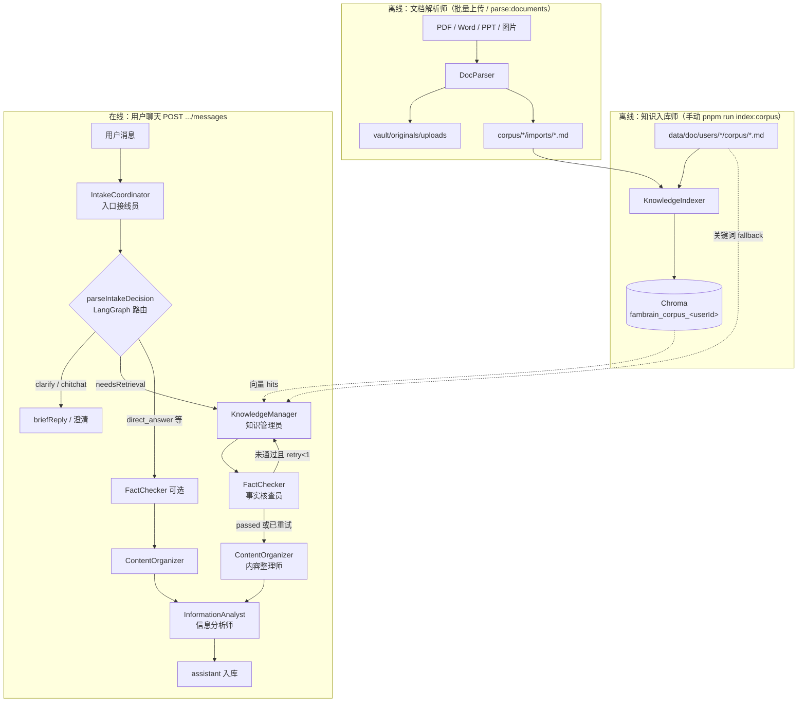
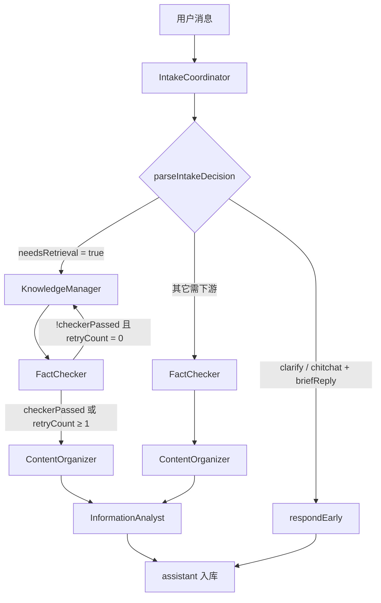
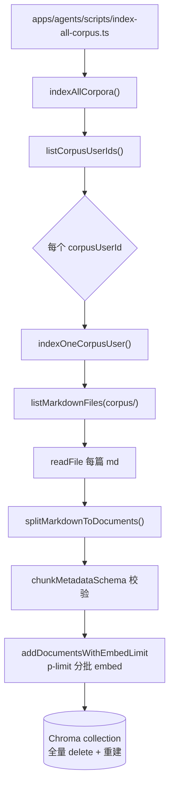
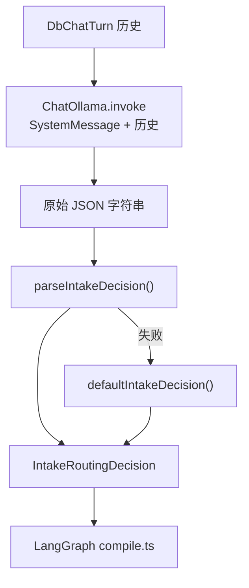
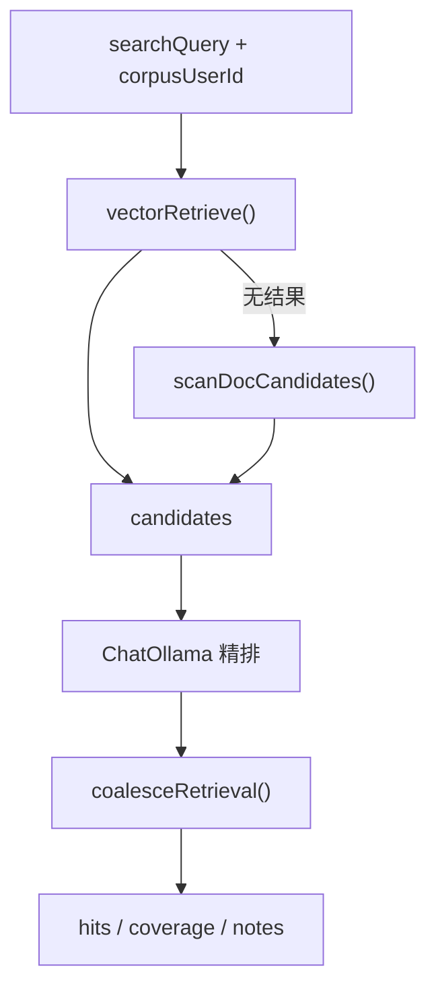
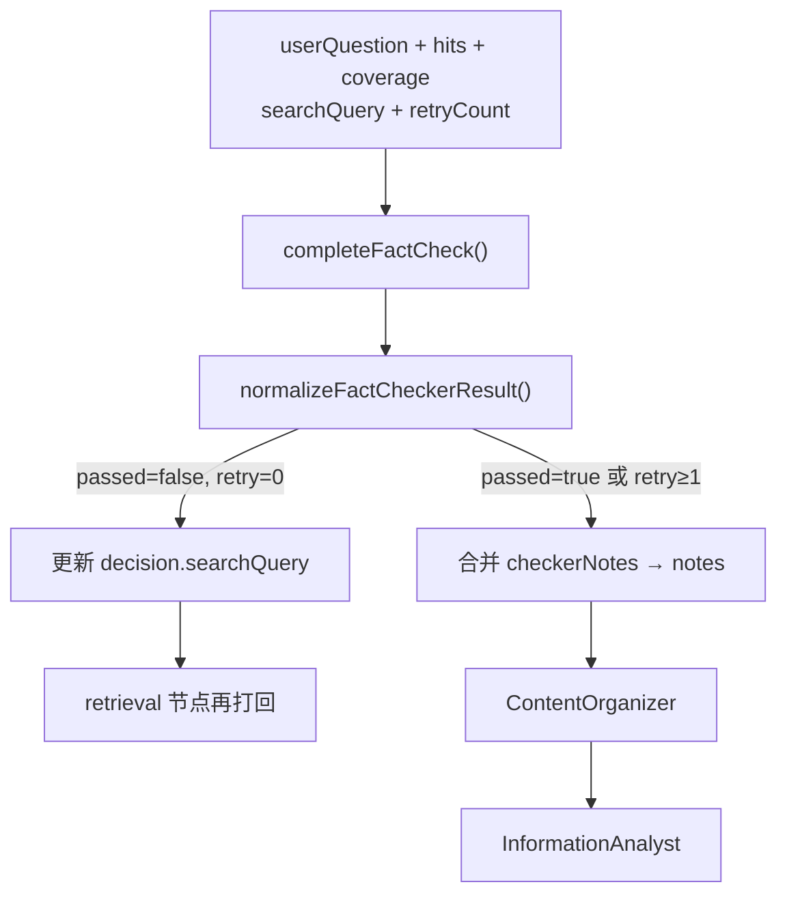
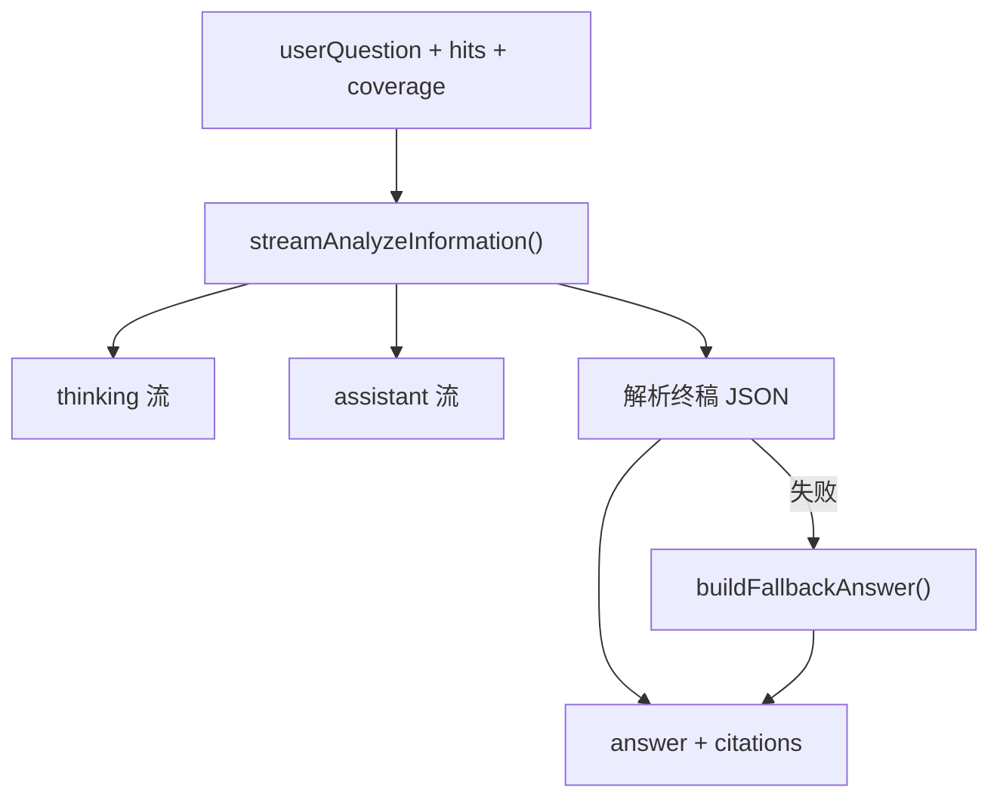
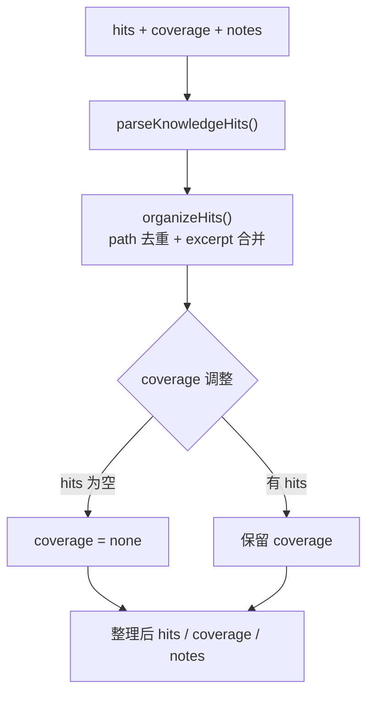
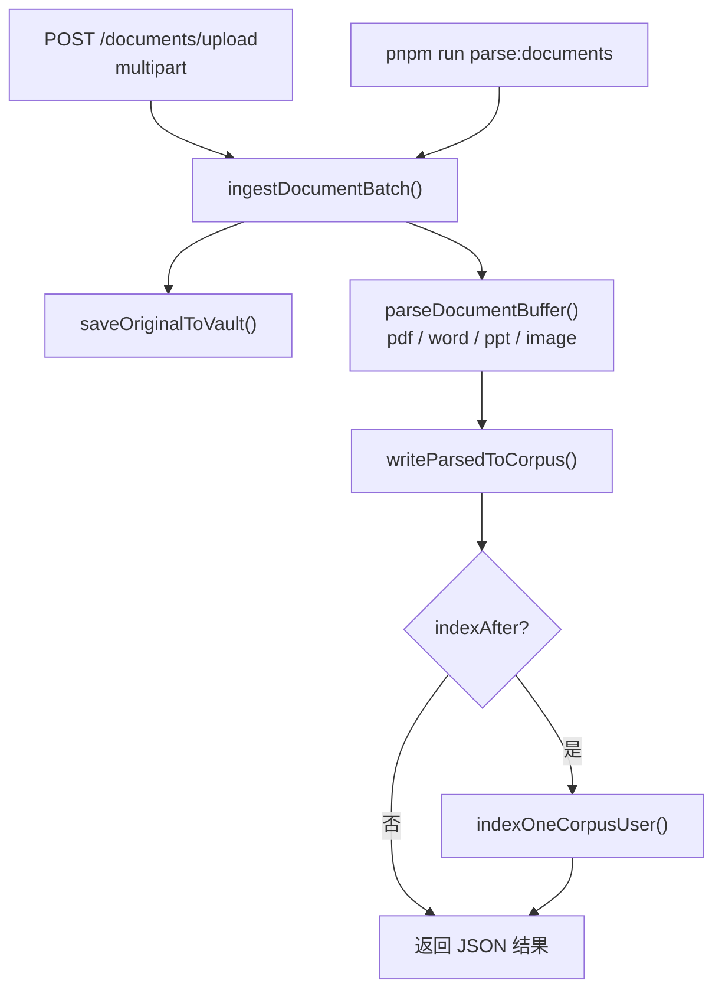

# Agent 流程图

[← 返回 README](../README.md) · [路线图](./03-roadmap.md) · [坑点清单](./04-pitfalls.md)

本文描述 FamBrain 多 Agent 的 **全局链路**、**在线编排**、**单 Agent 实现**（含规则 / 文件 / 方法），以及路由契约与 SSE 事件。

## P0 在线五 Agent 角色

| 英文名 | 中文名 | 职责 |
|--------|--------|------|
| `IntakeCoordinator` | 入口接线员 | 接收输入、理解意图、拆分任务、产出路由 JSON |
| `KnowledgeManager` | 知识管理员 | 检索知识库，返回 `hits` / `coverage` / `notes` |
| `FactChecker` | 事实核查员 | **检索后、生成前**审查证据包；不足时打回再检索（最多 1 次） |
| `ContentOrganizer` | 内容整理师 | **核查通过后**对 `hits` 做 Zod 规范化与 path 去重，再交给分析师 |
| `InformationAnalyst` | 信息分析师 | 对整理后的检索结果分析、归纳并回答 |

**里程碑：** 用户提问 → 意图识别 → 检索 → **证据核查** → **内容整理** → 分析 → 回答。（LangGraph 编排 **已实现**；KM：**向量 + 关键词 fallback**；FactChecker / ContentOrganizer：**D5/D6 已接入**，跨轮 cache 见 [坑点 §2.2](./04-pitfalls.md)。）

## 全链路总览（离线入库 + 在线对话）

> **进度（2026-06-02）：** 离线 `KnowledgeIndexer` ✅（p-limit 分批 embed）；在线 KM 已接 Chroma `vectorRetrieve` + 关键词 fallback；`FactChecker` + **`ContentOrganizer`** 已接入 LangGraph（`pipeline/graph/compile.ts`）；在线 Agent JSON 解析均走 Zod。

## P0 在线编排流程

入口接线员只输出 **JSON 路由决策**；**进哪个节点由 LangGraph 查表决定**（`IntakeRoutingDecision` 见 `agentflow/agents/online/intake-coordinator/prompt.ts`），不是模型在回复里写「下一个 Agent 名字」。

实现：`apps/agents/src/agentflow/pipeline/graph/compile.ts` · 流式入口 `pipeline/graph/stream.ts` → `runPipelineStream()`。

## 单 Agent 实现流程

每个 Agent 一张图 + 步骤表（**规则 / 文件 / 方法**），便于对照代码。

### 1. KnowledgeIndexer — 知识入库师 ✅

**触发：** 手动 `pnpm run index:corpus`（语料 md 变更、换 embed 模型、改分块规则后重跑）。**不参与**用户聊天实时链路。

**技术：** LlamaIndex、ChromaDB、Ollama Embed、Zod（metadata）、Pino。

| 步骤 | 做什么 | 规则 | 文件 | 方法 |
|------|--------|------|------|------|
| 0 | CLI 入口 | 加载 `.env`；失败 exit 1 | `apps/agents/scripts/index-all-corpus.ts` | — |
| 1 | 找用户 | `data/doc/users/*` 下 corpus 至少有 1 个 `.md` | `list-corpus-users.ts` | `listCorpusUserIds()` |
| 2 | 路径约定 | 语料根 `users/<id>/corpus/` | `apps/agents/src/knowledge/doc-paths.ts` | `getUserCorpusRoot()` |
| 3 | 扫 md | 递归 `.md`；跳过 `vault/originals/images/...` | `list-markdown-files.ts` | `listMarkdownFiles()`, `toRepoPath()` |
| 4 | 读正文 | UTF-8 读全文 | `index-one-user.ts` | `readFile()` |
| 5 | 分块 | 按 `##` 切；无 `##` 整篇 1 块；`id_`=user:path:index | `split-markdown.ts` | `splitMarkdownToDocuments()` |
| 6 | metadata | path / title / chunkIndex / corpusUserId | `chunk-metadata.ts` | `chunkMetadataSchema.parse()` |
| 7 | embed | `OLLAMA_MODEL_EMBED`（默认 nomic-embed-text）；**p-limit** 限制并发批次数 | `embed-batches.ts`, `index-one-user.ts` | `addDocumentsWithEmbedLimit()`, `getEmbedIndexOptions()` |
| 8 | 存 Chroma | collection=`fambrain_corpus_<userId>`；**先删后建**（全量幂等） | `index-one-user.ts`, `constants.ts` | `ChromaVectorStore`, `getChromaServerUrl()` |
| 9 | 日志 | JSON 结构化 | `index.ts` | `indexerLogger`（pino） |

**前置：** 终端 1 `pnpm run chroma:server`；Ollama 可访问且已 pull embed 模型。

### 2. IntakeCoordinator — 入口接线员 ✅

**职责：** 只产 **路由 JSON**，不写终稿、不检索。

**技术：** LangChain `ChatOllama`、`SystemMessage` / `HumanMessage`；输出 **Zod**（`intakeRoutingSchema`）。

| 步骤 | 做什么 | 规则 | 文件 | 方法 |
|------|--------|------|------|------|
| 1 | 拼 prompt | 系统指令定义 intent / searchQuery 等 | `IntakeCoordinator/prompt.ts` | `prompt` |
| 2 | 调模型 | 一次 `invoke`；模型见 `OLLAMA_MODEL_INTAKE_COORDINATOR` | `IntakeCoordinator/ollama-chat.ts` | `completeIntakeCoordinator()` |
| 3 | 解析 JSON | 抠 JSON → **Zod parse**；失败不抛给用户 | `parse-intake.ts`, `schema.ts` | `parseIntakeDecision()`, `intakeRoutingSchema` |
| 4 | 兜底 | 解析失败 → `needsRetrieval=true` 保守查库 | `pipeline/parse-intake.ts` | `defaultIntakeDecision()` |
| 5 | 编排 | LangGraph 条件边 | `pipeline/graph/compile.ts` | `getCompiledPipelineGraph()` |

### 3. KnowledgeManager — 知识管理员 ✅

**职责：** 产出 `hits[]`（path / excerpt / relevance），不对用户说话。

**技术：** LangChain `ChatOllama`（精排）；**向量检索** + 关键词扫描 fallback。

| 步骤 | 做什么 | 规则 | 文件 | 方法 |
|------|--------|------|------|------|
| 1 | 向量预扫 | Chroma collection per user | `vector-retrieve.ts`, `knowledge/chroma-rag.ts` | `vectorRetrieve()` |
| 2 | 关键词 fallback | `experience/projects/personal`；中文二元切分 | `retrieve.ts` | `scanDocCandidates()`, `tokenize()` |
| 3 | LLM 精排 | 只从 candidates 选 | `retrieve.ts`, `prompt.ts` | `retrieveKnowledge()` |
| 4 | 回退 | LLM 空 hits → 关键词合并 | `retrieve.ts` | `coalesceRetrieval()` |
| 5 | 输出 | 最多 5 条；coverage 三档 | `prompt.ts` | `KnowledgeRetrievalResult` |

### 4. FactChecker — 事实核查员（D5）🔄

**职责：** 审查当轮 `hits` / `coverage` 是否足以回答 `userQuestion`；**不写终稿**。`passed=false` 时产出 `refinedSearchQuery`，编排器最多再打回 KM **1 次**。

**技术：** LangChain `ChatOllama`；规则兜底 `buildRuleBasedFactCheck()`；输出 **Zod**（`factCheckerResultSchema`）；`retryCount≥1` 时代码强制放行。

| 步骤 | 做什么 | 规则 | 文件 | 方法 |
|------|--------|------|------|------|
| 1 | 输入 | 含 `retryCount`（0=首次，1=已重试） | `fact-checker/prompt.ts` | `FactCheckerInput` |
| 2 | 调模型 | 与 Intake 同 `OLLAMA_MODEL_INTAKE_COORDINATOR` | `check-facts.ts` | `completeFactCheck()` |
| 3 | 解析 | JSON → **Zod** → `passed` / `evidenceScore` / `issues` | `check-helpers.ts`, `schema.ts` | `normalizeFactCheckerResult()` |
| 4 | 兜底 | LLM 失败走规则；重试后强制 `passed=true` | `check-helpers.ts` | `buildRuleBasedFactCheck()` |
| 5 | 编排 | `checkerPassed` → contentOrganizer 或 retrieval | `pipeline/graph/compile.ts` | `factCheckerNode()`, `routeAfterFactChecker()` |

**验证：** `pnpm run verify:fact-checker`（规则）、`pnpm run verify:fact-checker:pipeline`（全链路）。跨轮重复问仍全量检索见 [坑点 §2.2](./04-pitfalls.md)。

### 5. InformationAnalyst — 信息分析师 ✅

**职责：** 据整理后的 `hits` 写终稿；无证据时 `insufficientEvidence`，禁止编造履历。

**技术：** Ollama 流式（thinking + assistant）；终稿 JSON **Zod**（`analystResultSchema`）。

| 步骤 | 做什么 | 规则 | 文件 | 方法 |
|------|--------|------|------|------|
| 1 | 输入 | 只认上游 hits；不自己检索 | `InformationAnalyst/prompt.ts` | `InformationAnalystInput` |
| 2 | 流式 | thinking + assistant SSE | `InformationAnalyst/stream.ts` | `streamAnalyzeInformation()` |
| 3 | 终稿 JSON | answer / citations / insufficientEvidence；**Zod parse** | `analyze-helpers.ts`, `schema.ts` | `normalizeAnalystResult()` |
| 4 | 兜底 | 解析失败用 hits 拼可读回答 | `analyze-helpers.ts` | `buildFallbackAnswer()` |
| 5 | 落库 | LangGraph `analyst` 节点 + SSE custom 流 | `pipeline/graph/compile.ts`, `stream.ts` | `analystNode()`, `streamAnalyzeInformation()` |

### 6. ContentOrganizer — 内容整理师（D6）✅

**职责：** 在 FactChecker 放行后、Analyst 生成前，对 `hits` 做 **Zod 规范化**、**同 path 去重**、excerpt 合并；空 hits 时将 `coverage` 降为 `none`。**不调 LLM**。

**技术：** Zod（`knowledgeHitsSchema`）；规则合并（`organizeHits` / `dedupeCitations`）。

| 步骤 | 做什么 | 规则 | 文件 | 方法 |
|------|--------|------|------|------|
| 1 | 输入 | 上游 KM + FactChecker 的 `hits` / `coverage` / `notes` | `content-organizer/prompt.ts` | `ContentOrganizerInput` |
| 2 | Zod 校验 | 丢弃非法 hit 字段 | `content-organizer/schema.ts` | `parseKnowledgeHits()` |
| 3 | path 去重 | 同 path 保留最高 relevance；excerpt 合并（≤320 字） | `organize-hits.ts` | `organizeHits()`, `normalizeDocPath()` |
| 4 | coverage | hits 为空 → `none` | `organize-knowledge.ts` | `organizeKnowledge()` |
| 5 | 编排 | FactChecker 后固定进入 | `pipeline/graph/compile.ts` | `contentOrganizerNode()` |

**验证：** `pnpm run verify:content-organizer`；全 Agent schema：`pnpm run verify:agent-schemas`。

### 7. DocParser — 文档解析师（D7）✅

**触发：** `POST /api/documents/upload`（Web 代理 → Agents `POST /documents/upload`）或 CLI `pnpm run parse:documents -- <userId> <files...>`。**不参与**在线聊天实时链路。

**职责：** 批量接收 PDF / Word / PPT / 图片 → 解析为 Markdown → 原件存 `vault/originals/uploads`，语料写 `corpus/<category>/imports/` → 可选触发 `KnowledgeIndexer` 全量入库。

**技术：** pdf-parse、officeparser、mammoth（docx）、Ollama vision OCR（图片）、p-limit 并发、Zod（结果 schema）、Pino。

| 步骤 | 做什么 | 规则 | 文件 | 方法 |
|------|--------|------|------|------|
| 0 | HTTP / CLI | JWT 鉴权；字段 `corpusUserId` / `category` / `indexAfter` | `server/documents-upload.ts`, `scripts/parse-documents.ts` | `handleDocumentsUpload()` |
| 1 | 存原件 | `users/<actor>/vault/originals/uploads/` | `write-corpus-md.ts` | `saveOriginalToVault()` |
| 2 | 解析 | PDF→pdf-parse；Word→mammoth/docx+officeparser；PPT→officeparser；图片→Ollama OCR | `parse-file.ts`, `parse-image-ocr.ts` | `parseDocumentBuffer()` |
| 3 | 写 md | `corpus/<experience\|projects\|personal>/imports/` | `write-corpus-md.ts` | `writeParsedToCorpus()` |
| 4 | 入库 | 默认 `indexAfter=true` 触发全量 Chroma 重建 | `ingest-batch.ts` | `ingestDocumentBatch()` |
| 5 | 并发 | `DOC_PARSE_CONCURRENCY`（默认 2） | `ingest-batch.ts` | `getDocParseConcurrency()` |

**验证：** `pnpm run verify:doc-parser`（格式 / 路径 / Markdown 单测，不依赖 Ollama）。

## 路由字段（IntakeCoordinator 输出）

| 英文字段 | 中文名 | 含义 | 典型去向 |
|----------|--------|------|----------|
| `intent` | 意图类型 | 查库回答 / 直接答 / 澄清 / 闲聊 / 拒答 | 编排器分支 |
| `needsRetrieval` | 是否需要检索 | `true` 时必须走知识管理员 | → KnowledgeManager |
| `searchQuery` | 检索查询句 | 去掉寒暄后的检索关键词句 | → KnowledgeManager 入参 |
| `subTasks` | 子任务列表 | 复杂问题拆成多句 | → KM / Analyst |
| `topics` | 主题标签 | 如 `resume`、`aky` | → KnowledgeManager 入参 |
| `language` | 回复语言 | `zh` / `en` / `mixed` | → InformationAnalyst 入参 |
| `confidence` | 置信度 | 0–1，可观测、可降级 | 日志 / 后续策略 |
| `clarifyingQuestion` | 澄清提问 | 信息不足时追问一个关键问题 | **直接返回用户** |
| `briefReply` | 简短回复 | 寒暄或拒答（≤80 字） | **直接返回用户** |

## 编排分支（`pipeline/graph/compile.ts`）

| 条件 | 节点顺序 | 用户看到什么 |
|------|----------|--------------|
| `intent === "clarify"` 且 `clarifyingQuestion` 有值 | `respondEarly` | 澄清提问 |
| `intent` 为 `chitchat` / `out_of_scope` 且 `briefReply` 有值 | `respondEarly` | 简短回复 |
| `needsRetrieval === true` | KM → **FactChecker** → **ContentOrganizer** →（可选再打回 KM）→ Analyst | SSE：检索 → 核查 → **整理证据** → 整理回答 |
| `needsRetrieval === false` 且无 `briefReply` | FactChecker → **ContentOrganizer** → Analyst（`hits` 常为空） | 不查库长答 |
| FactChecker `passed=false` 且 `retryCount<1` | 再 `retrieval` → 再 **FactChecker** | 同轮可能见两次「核查证据…」 |
| 其余 | `respondEarly` | 简短说明或请用户补充 |

## 流式 SSE 事件（`POST .../messages`）

| `event` | 含义 |
|---------|------|
| `meta` | 用户消息已落库（含真实 `id`） |
| `step` | 编排进度：`intake` / `retrieval` / `fact_checker` / **`content_organizer`** / `analyst`，`status` 为 `running` \| `done` |
| `thinking` | 信息分析师推理流（若模型/Ollama 支持） |
| `assistant` | 面向用户的正文增量（流结束后以 `answer` 写入 DB） |
| `done` | 流结束，含 user/assistant 消息 id 与终稿 `content` |
| `error` | 模型或编排失败 |
