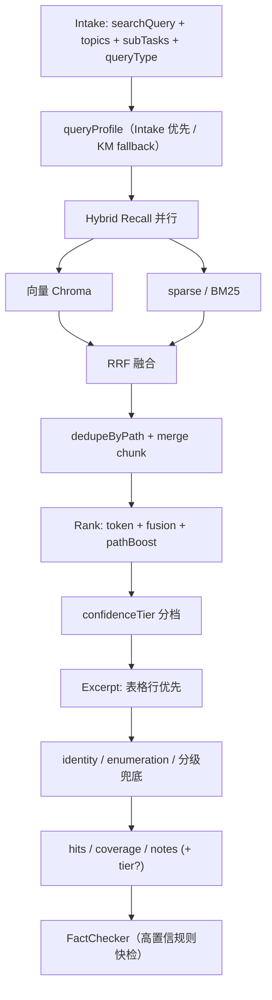

# KnowledgeManager 检索设计（KM v3 · 业界对标）

> **基线：** [§2.1.1 KM 规则精排已消坑](./04-pitfalls.md#211-km-移除在线-llm--规则精排p0-4--d3-2--d3-3--d3-5---已消坑-2026-06)（v1，无在线 LLM）  
> **原则：** 检索层不调 Chat LLM；快、稳、可回归；Pipeline 对外合同保持 `hits / coverage / notes`（可选扩展 `confidenceTier`）  
> **范围：** **KM 为主** + 必须/建议配合的模块；FC / Organizer / Analyst 默认不动

> **代码布局：** 见 `apps/brain-service/src/agentflow/agents/online/knowledge-manager/README.md`（`contract/` · `nodes/` · `pipeline/` · `recall/` · `profile/`）。

---

| 业界层 | 标准能力 | 现状 | v3 目标 |
|--------|----------|------|---------|
| **查询理解** | 意图分类、指代补全、query 改写 | Intake 出 `searchQuery/topics/subTasks` | Intake 增 `queryType`；KM 内规则 profile 作 fallback |
| **混合召回** | 向量 ∥ BM25/sparse → RRF | 串行：向量 → 低置信才扫盘 | **并行 Hybrid + RRF** |
| **置信评估** | 融合分 + 分档路由 | 向量距离阈值 + `coverage` 规则 | 多维置信 + 可选 `confidenceTier` |
| **结果加工** | dedupe、excerpt、Cross-Encoder | 规则 rank + pickExcerpt | pathBoost、guard、表格 excerpt、可选 rerank |
| **多级兜底** | 改写重查 → FAQ → 无知识标识 | scan + ensureNonEmptyHits | 分级兜底；FC retry 保留 |

**Pipeline 分工：**

```text
Intake（查询理解）→ KM（混合召回～兜底）→ FactChecker → ContentOrganizer → Analyst
                  ↑ 主战场
```

---

## 二、模块改动量总览

| 模块 | 改动级别 | 与 KM 关系 |
|------|----------|------------|
| **knowledge-manager** | 最大 | 主战场 |
| **packages/corpus** | 大 | Hybrid 稀疏路 / 向量 raw topK |
| **intake-coordinator** | 中 | 查询理解上移到 Intake |
| **pipeline**（compile / parse-intake / state） | 小 | 传 `queryType`、retry 语义 |
| **brain-shared**（agent-log） | 小 | 可观测字段 |
| **scripts** | 小 | verify / compare-recall |
| **fact-checker** | 可选 | 高置信规则快检 |
| **content-organizer** | 可选小 | structuredFields |
| **information-analyst** | 暂不动 | 吃 hits |

---

## 三、已实现能力（基线）

| ID | 说明 |
|----|------|
| KM-01 | topics 仅参与向量 query，不参与字面 tokenize |
| KM-02 | 向量结果按 path 去重（max 2 chunk/path） |
| KM-03～06 | pathBoost、rank、兜底、verify 脚本 |
| KM-04 | 常量集中到 `km-config.ts` |
| KM-08～09 | queryProfile + 分档 topK/maxHits |
| KM-10～16 | 表格 excerpt、identity guard、列举 fill、coverage/notes、chunk merge |
| HY-01～07 | BM25 sparse、并行 Hybrid、RRF 融合 |
| QU-01～06 | Intake `queryType` → pipeline → KM |
| EV-01～07 | confidenceTier 分档、FC 高置信快检 |

**v1 长期保留：** 向量召回（Chroma）、规则精排（无 Chat LLM）、`ensureNonEmptyHits`、FC `refinedSearchQuery` 二次检索。

**待做（可选）：** FAQ 短路（RC-01）、Cross-Encoder rerank（PR-01）、structuredFields（PR-02～03）、KM 内 query 放宽重查（FB-01）、外部搜索兜底（FB-03）。

---

## 四、对外合同

| 字段 | 说明 |
|------|------|
| `hits[]` | 检索片段列表 |
| `coverage` | sufficient / partial / none |
| `notes` | KM 给下游的备注 |
| `confidenceTier`（可选） | high / mid / low |

`KnowledgeManagerInput` 可选：`queryType?: "identity" | "enumeration" | "tech" | "default"`。

---

## 五、架构示意



---

## 六、queryProfile 参数表

| queryProfile | 典型问法 | vectorTopK | maxHits | 召回 | 专项 guard |
|--------------|----------|------------|---------|------|------------|
| identity | 我叫什么、姓名 | 12 | 4 | hybrid（向量 + sparse） | personal 简历 Top1 |
| enumeration（**experience**） | 哪几家公司 | 24 | 8 | **experience/** 全量 + fill | 每经历文件 ≥1 hit |
| enumeration（**project**） | 哪些项目、项目名称 | 24 | 8 | **projects/** 全量 + fill | 每项目 md ≥1 hit |
| **external_link** | GitHub / 仓库 / 对外 URL | 16 | 6 | hybrid | **personal 简历 + 含 URL 行** boost；`pickExcerpt` 优先 URL |
| tech | 技术栈、框架 | 16 | 6 | hybrid | — |
| default | 其余 | 12 | 5 | hybrid | — |

Intake `queryType` 与上表 **同名枚举**。

---

## 七、刻意不做

| 项 | 原因 |
|----|------|
| KM 内 **Chat LLM** 精排 | v1 已证伪；精排用 RRF + Cross-Encoder |
| 改 Chroma **Indexer 切块** | 离线范围；Hybrid 稳定后再评估 |
| Mem0 优先级 | Analyst 域（P0-14） |
| 跨轮检索 **cache** | 编排层（D5-2） |
| ES 集群 | MVP 用 corpus 内 BM25；规模上来再换 |

---

## 八、验收命令

| 命令 | 说明 |
|------|------|
| `pnpm --filter @fambrain/brain-service run verify:sparse-recall` | BM25 sparse 三问 |
| `pnpm --filter @fambrain/brain-service run verify:hybrid-recall` | RRF 单测 + hybridRecall live |
| `pnpm --filter @fambrain/brain-service run verify:recall-compare` | 三问 vector/sparse/RRF（需 Chroma） |
| `pnpm --filter @fambrain/brain-service run verify:km-retrieve` | 规则单测：pathBoost、rank、queryProfile |
| `pnpm --filter @fambrain/brain-service run verify:km-retrieve:live` | 真实语料 KM 五问 |
| `pnpm --filter @fambrain/brain-service run verify:confidence-tier` | 置信分档单测 + KM live |
| `pnpm --filter @fambrain/brain-service run verify:intake-coreference` | Intake 多轮指代 |
| `pnpm --filter @fambrain/brain-service run verify:intake-link-lookup` | P0-25：external_link guard + stale multipart 单测 |
| `pnpm --filter @fambrain/brain-service run eval:run` | Eval MVP |

**全链路 spot check：**

- 「我的名字是什么？」→ Top1 `personal/个人简历-潘展飞.md`，excerpt 含姓名表格行
- 「我在哪几家公司上过班？」→ hits 均为 `experience/*.md`，notes 含列举覆盖段数
- 「开源项目的 GitHub 链接有哪些？」→ `queryType=external_link`；hits 含 `github.com/panzhanfei/sentinel-monorepo` 与 `release-bot`（**非** aky offline 路径）

---

## 九、变更记录

| 日期 | 说明 |
|------|------|
| 2026-06 | v3 定稿：业界五层对标；Hybrid + RRF 接入主链 |
| 2026-06 | Intake `queryType`、confidenceTier、列举 project/experience 分流 |
| 2026-07 | 文档精简：移除排期表，保留设计与验收 |
| 2026-07 | **`external_link` queryProfile**（P0-25）；Intake link lookup + continuation guard |
| 2026-07 | **单问/多问 routeMode 合并为 `slots`（1～N 槽）**；`query-signals` 结构对齐 stale multipart |
