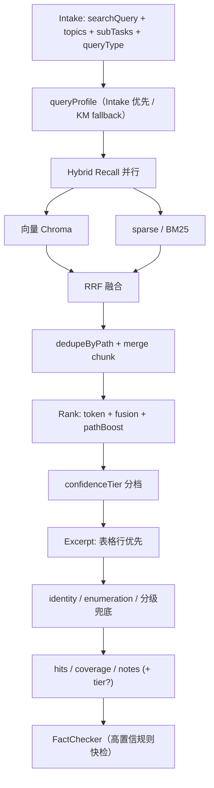

# KnowledgeManager 检索设计（KM v3 · 业界对标）

> **状态：** 计划已定稿 · **实现策略：** 按 Wave 逐条落地，每步可单独验收  
> **基线：** [§2.1.1 KM 规则精排已消坑](./04-pitfalls.md#211-km-移除在线-llm--规则精排p0-4--d3-2--d3-3--d3-5---已消坑-2026-06)（v1，无在线 LLM）  
> **原则：** 检索层不调 Chat LLM；快、稳、可回归；**Wave A～C 不动** Pipeline 对外合同（`hits / coverage / notes`）；Wave D 起可选扩展字段  
> **范围：** **KM 为主** + 必须/建议配合的模块；FC / Organizer / Analyst **默认不动**

---

## 一、业界五层 vs 现状

| 业界层 | 标准能力 | 现状 | v3 目标 |
|--------|----------|------|---------|
| **L1 查询理解** | 意图分类、指代补全、query 改写 | Intake 出 `searchQuery/topics/subTasks` | Intake 增 `queryType`；KM 内规则 profile 作 fallback |
| **L2 混合召回** | 向量 ∥ BM25/sparse → RRF | 串行：向量 → 低置信才扫盘 | **并行 Hybrid + RRF** |
| **L3 置信评估** | 融合分 + 分档路由 | L2 阈值 + `coverage` 规则 | 多维置信 + 可选 `confidenceTier` |
| **L4 加工** | dedupe、excerpt、Cross-Encoder | 规则 rank + pickExcerpt | pathBoost、guard、表格 excerpt、可选 rerank |
| **L5 多级兜底** | 改写重查 → FAQ → 无知识标识 | scan + ensureNonEmptyHits | 分级兜底；FC retry 保留 |

**Pipeline 分工（不改大架构）：**

```text
Intake（L1）→ KM（L2～L5）→ FactChecker → ContentOrganizer → Analyst
                  ↑ 主战场
```

---

## 二、模块改动量总览

| 模块 | 改动级别 | 与 KM 关系 |
|------|----------|------------|
| **knowledge-manager** | 最大（架构重写） | 主战场 |
| **packages/corpus** | 大 | Hybrid 稀疏路 / 向量 raw topK |
| **intake-coordinator** | 中 | L1 查询理解上移（Wave C） |
| **pipeline**（compile / parse-intake / state） | 小 | 传 `queryType`、retry 语义 |
| **agent-shared**（agent-log） | 小 | 可观测字段 |
| **scripts** | 小 | verify / compare-recall |
| **fact-checker** | 可选中小 | 高置信规则快检（Wave D） |
| **content-organizer** | 可选小 | structuredFields（Wave E） |
| **information-analyst** | 暂不动 | 吃 hits；Wave F 防编造 prompt |
| **docs** | 小 | 架构文档同步 |

---

## 三、主计划表（按优先级）

**图例：** 类型 = **增** / **改** / **删** · 配合 = **必配** / **建议** / **—** · 状态 = ⬜ / 🔄 / ✅

| 优先级 | ID | 业界层 | 模块 | 类型 | 做什么 | 主要文件 | 配合 | 依赖 | 状态 | 验收（一句话） |
|:------:|:---:|--------|------|:----:|--------|----------|:----:|------|:----:|----------------|
| **P0-1** | KM-03 | L4 | KM | 增 | **pathBoost** 路径权威表（personal↑、projects/resume↓） | `km-config.ts` | — | KM-04 | ✅ | 姓名类 Top1 为 `personal/` |
| **P0-2** | KM-05 | L4 | KM | 改 | **rank 公式**：token + vector + pathBoost，封顶 1.0 | `retrieve.ts`、`retrieve-helpers.ts` | — | KM-03 | ✅ | 日志可见 `topRank.pathBoost` |
| **P0-3** | KM-06 | L5 | KM | 改 | **ensureNonEmptyHits** 按加权排序补选，非裸 Top1 | `retrieve.ts` | — | KM-05 | ✅ | token 弱时仍优先 personal |
| **P0-4** | KM-07 | — | scripts | 增 | **verify-km-retrieve** 单测（不测全链路） | `scripts/verify-km-retrieve.ts` | — | KM-03～06 | ✅ | `pnpm run verify:km-retrieve` 绿 |
| **P0-5** | KM-10 | L4 | KM | 增 | **表格 excerpt**（`\| 姓名 \| xxx \|` 优先） | `retrieve-helpers.ts` | — | — | ✅ | 姓名 excerpt 含表格行 |
| **P0-6** | KM-08 | L1 | KM | 增 | **queryProfile** 规则推断（identity/enumeration/tech/default） | `query-profile.ts`、`retrieve.ts` | — | — | ✅ | 固定问法 profile 正确 |
| **P0-7** | KM-09 | L2 | KM | 改 | 按 profile 分档 **vectorTopK / maxHits** | `km-config.ts`、`retrieve.ts` | — | KM-08 | ✅ | 列举 maxHits=8 |
| **P0-8** | KM-11 | L4 | KM | 增 | **identityGuard**：有 personal 简历则强制 Top1；扫盘未命中时 **补注入** personal 简历 | `retrieve.ts`、`retrieve-helpers.ts` | — | KM-08 | ✅ | 裸问「我的名字」Top1 为 personal |
| **P0-9** | KM-13 | L2 | KM | 改 | 列举 profile **主动扫 experience/** 全目录 | `retrieve.ts` | — | KM-08 | ✅ | 「哪几家公司」覆盖多文件 |
| **P0-10** | KM-14 | L5 | KM | 增 | **enumerationFill**：每 experience/*.md ≥1 hit | `retrieve-helpers.ts` | — | KM-13 | ✅ | hits 覆盖全部经历文件 |
| **P0-10b** | KM-13b | L2 | KM | 增 | 列举 **project** target：扫 **projects/** + fill（`resolveEnumerationTarget`） | `retrieve.ts`、`enumeration-target.ts` | — | KM-08 | ✅ | 「项目名称」槽 hits 为 projects/ |
| **P0-11** | KM-15 | L3 | KM | 改 | 列举型 **coverage / notes** 文案 | `retrieve-helpers.ts` | — | KM-14 | ✅ | notes 标明是否补全 |
| **P0-12** | KM-12 | L3 | KM | 改 | 日志增加 `queryProfile`、`vectorTopK`、`maxHits`、`topRank`、`guardApplied` | `retrieve.ts` | 建议 agent-log | KM-08 | ✅ | KM 📤 可见 guardApplied |
| **P0-13** | KM-16 | L4 | KM | 改 | 同 path 多 chunk **merge body** 再摘抄 | `retrieve-helpers.ts` | — | KM-02 | ✅ | 同文件 excerpt 更完整 |
| **P1-1** | HY-01 | L2 | corpus | 改 | 升级 **sparse 检索**（keyword → **BM25**） | `recall-keyword-retrieve.ts`、`bm25.ts` | 必配 KM | — | ✅ | `verify:sparse-recall` 绿；sparse 独立出 candidates |
| **P1-2** | HY-02 | L2 | KM | 增 | **hybrid-recall**：向量 ∥ sparse **并行**召回 | `hybrid-recall.ts` | 必配 corpus | HY-01 | ✅ | 两路 `Promise.all`，不再串行 fallback |
| **P1-3** | HY-03 | L2 | KM | 增 | **RRF 融合**（倒数排名融合） | `fusion-rrf.ts` | — | HY-02 | ✅ | 融合分排序 ≠ 单路 Top1 |
| **P1-4** | HY-04 | L2 | KM | 改 | **删/弱** 主路径「向量低置信 → 才 scanDocCandidates」 | `retrieve.ts` | — | HY-02 | ✅ | `recallSource`: hybrid/vector/sparse/empty |
| **P1-5** | HY-05 | L2 | KM | 改 | 统一 **Candidate**：`recallChannel`、`rawScore` | `types.ts` | — | HY-02 | ✅ | vector/sparse/hybrid 可区分 |
| **P1-6** | HY-06 | L2 | corpus | 改 | 向量 **raw topK 加大**（融合前多取，dedupe 后截） | `km-config.ts`（`VECTOR_FETCH_MULTIPLIER`） | 建议 KM | HY-03 | ✅ | 融合前 fetchK = topK × 2 |
| **P1-7** | HY-07 | — | scripts | 改 | compare-recall 或并入 verify：对比 vector/sparse/RRF | `verify-recall-compare.ts` | — | HY-03 | ✅ | 三问 A/B + Chroma hybrid 必过 |
| **P2-1** | QU-01 | L1 | Intake | 增 | 输出 **queryType**（与 KM profile 对齐） | `schema.ts`、`prompt.ts` | 必配 pipeline | P0-6 或并行 | ✅ | Intake JSON 含 queryType |
| **P2-2** | QU-02 | L1 | Intake | 改 | **多轮指代补全** searchQuery | `prompt.ts`、`intake-coreference-guard.ts` | — | — | ✅ | G5 clarify + G5b 有上文检索 |
| **P2-3** | QU-03 | L1 | pipeline | 改 | `compile.ts` 传 **queryType** 给 `retrieveKnowledge` | `compile.ts` | 必配 QU-01 | QU-01 | ✅ | retrievalNode 入参含 queryType |
| **P2-4** | QU-04 | L1 | pipeline | 改 | `parse-intake.ts` / `state.ts` 扩展 decision | `parse-intake.ts`、`state.ts` | 必配 QU-01 | QU-01 | ✅ | schema 校验通过 |
| **P2-5** | QU-05 | L1 | KM | 改 | KM **优先 Intake queryType**，无则规则 fallback | `retrieve.ts`、`query-profile.ts` | 建议 | QU-03 | ✅ | 双源一致时不重复推断 |
| **P2-6** | QU-06 | L1 | KM | 删/弱 | KM 内纯规则 queryProfile（Intake 稳定后） | `query-profile.ts` | — | QU-05 | ✅ | null→default；infer 仅脚本/兜底 |
| **P3-1** | EV-01 | L3 | KM | 改 | **多维置信度**：融合分 + top1-top2 gap + path 权威 | `score-candidate.ts` | — | HY-03、KM-05 | ✅ | high/mid/low 分档稳定 |
| **P3-2** | EV-02 | L3 | KM | 改 | **coverage** 基于分档，非单一 token 比 | `retrieve.ts` | — | EV-01 | ✅ | sufficient 与 hits 一致 |
| **P3-3** | EV-03 | L3 | KM | 改 | **删/弱** 无差别 ensureNonEmptyHits；低置信才补 | `retrieve.ts` | — | EV-01 | ✅ | 高冲突 query 不硬塞 Top1 |
| **P3-4** | EV-04 | L3 | KM | 增 | 输出可选 **`confidenceTier`**（向后兼容） | `types.ts` | 建议 FC | EV-01 | ✅ | 旧 FC 仍工作 |
| **P3-5** | EV-05 | L3 | FC | 改 | 高置信 **规则快检**跳过 LLM | `check-facts.ts` | 建议 | EV-04 | ✅ | 姓名类 FC 不调 LLM（tier_skip_llm） |
| **P3-6** | EV-06 | L3 | pipeline | 改 | FC retry 可选传 tier / refinedSearchQuery | `compile.ts` | 建议 | EV-04 | ✅ | retry 与 KM 分档一致 |
| **P3-7** | EV-07 | L3 | agent-log | 改 | 日志：`recallChannel`、`fusionScore`、`confidenceTier` | `agent-log.ts`、`retrieve.ts` | 建议 | EV-01 | ✅ | 联调一眼看出走了哪路 |
| **P4-1** | RC-01 | L2 | KM | 增 | **FAQ / 规则前置**（高频问直接 hit） | `faq/faq-matcher.ts` | — | HY-02 | ⬜ | 「我叫什么」可走 FAQ 短路 |
| **P4-2** | PR-01 | L4 | KM | 增 | **Cross-Encoder rerank** TopN（非 Chat LLM） | `rank/rerank-cross-encoder.ts` | — | EV-01 | ⬜ | mid 档精排后 Top1 更准 |
| **P4-3** | PR-02 | L4 | KM | 增 | 按 queryType **structuredFields** | `structured-extract.ts` | 建议 Organizer | EV-01 | ⬜ | 输出含 `{ name: "..." }` 等 |
| **P4-4** | PR-03 | L4 | Organizer | 改 | 接 optional **structuredFields** | `organize-hits.ts`、`schema.ts` | 建议 | PR-02 | ⬜ | 无字段时行为不变 |
| **P5-1** | FB-01 | L5 | KM | 增 | **一级兜底**：query 放宽后重跑 Hybrid（KM 内 1 次） | `retrieve.ts` | 建议 pipeline | HY-03 | ⬜ | 低置信自动放宽再查 |
| **P5-2** | FB-02 | L5 | pipeline | 改 | **二级兜底**：FC retry + refinedSearchQuery | `compile.ts` | — | 已有 | ✅ | retryCount≤1 |
| **P5-3** | FB-03 | L5 | KM | 增 | **三级兜底**：外部搜索 / MCP（可选） | experiments → KM | — | FB-01 | ⬜ | 语料无命中时有外源 |
| **P5-4** | FB-04 | L5 | KM | 改 | **四级**：明确 coverage:none + notes | `retrieve.ts` | — | EV-03 | ⬜ | 无命中 notes 清晰 |
| **P5-5** | FB-05 | L5 | Analyst | 改 | coverage:none / hits 空时 **禁止编造**（P0-12） | `stream.ts` `shouldSkipAnalystLlm` | 建议 | FB-04 | ✅ | `verify:analyst-empty-hits` |
| **—** | DOC-01 | — | docs | 改 | 本文 + 架构图 v3（Hybrid/RRF） | 本文 | — | 各 Wave | 🔄 | Wave A 进度已同步 |
| **—** | DOC-02 | — | docs | 改 | 同步 `02-agent-flows` KM 步骤 | `02-agent-flows.md` | — | DOC-01 | ⬜ | 流程图与代码一致 |
| **—** | DOC-03 | — | docs | 改 | 坑点表 D3/R6 状态 | `04-pitfalls.md` | — | Wave A | ⬜ | 对应坑 ✅ |

### 已完成（v2 基线，不推翻）

| ID | 说明 | 状态 |
|----|------|:----:|
| KM-01 | topics 仅参与向量 query，不参与字面 tokenize | ✅ |
| KM-02 | 向量结果按 path 去重（max 2 chunk/path） | ✅ |
| KM-04 | 常量集中到 `km-config.ts` | ✅ |
| KM-03～06 | pathBoost、rank、兜底、verify 脚本 | ✅ |
| KM-08～09 | queryProfile + 分档 topK/maxHits | ✅ |
| QU-01/03/04/05 | Intake `queryType` → compile → KM（Wave C 提前） | ✅ |

### v1 已有（长期保留）

| 能力 | 说明 |
|------|------|
| 向量召回 | `searchCorpusVectors`（Chroma） |
| 规则精排 | token 打分 + pickExcerpt（无 Chat LLM） |
| 硬兜底 | `ensureNonEmptyHits`（Wave A 增强 → Wave D 分级） |
| FC retry | `refinedSearchQuery` 二次检索（FB-02 ✅） |

---

## 四、实施波次（Wave A～F）

| Wave | 优先级 ID | 日历（参考） | 动哪些模块 | KM 单独能做？ | 必须配合 |
|------|-----------|--------------|------------|:-------------:|----------|
| **A** 规则层收尾 | P0-1～P0-13（KM-03～16，缺 KM-17/18 文档） | 1～2 天 | KM、scripts | ✅ | 无 |
| **B** Hybrid 核心 | P1-1～P1-7 | 1～2 周 | KM、corpus、scripts | 大部分 | **corpus 必配**；**HY-01 ✅** |
| **C** 查询理解上移 | P2-1～P2-6 | 3～5 天 | Intake、pipeline、KM | 可 fallback 规则 | **Intake + compile 必配** |
| **D** 置信分档 + FC 降本 | P3-1～P3-7 | 3～5 天 | KM 必做；FC/pipeline 建议 | ✅ tier 可选输出 | FC 建议 |
| **E** FAQ + 精排 + 结构化 | P4-1～P4-4 | 1～2 周 | KM；Organizer 建议 | FAQ/structured 在 KM | Organizer 建议 |
| **F** 多级兜底 + 防编造 | P5-1～P5-5 | 按需 | KM、pipeline、Analyst 建议 | 一二级在 KM | Analyst 建议 |

**推荐顺序：** A → B → C → D；E/F 稳定后补。

**Wave A 当日顺序（与旧 D1～D3 对齐）：**

| 顺序 | ID | 交付 |
|------|-----|------|
| 1 | KM-03 + KM-05 | pathBoost + rank |
| 2 | KM-06 | 兜底增强 |
| 3 | KM-07 | verify 脚本 |
| 4 | KM-08 + KM-09 | queryProfile + 分档 |
| 5 | KM-10 + KM-11 ✅ | 表格 excerpt + identity guard |
| 6 | KM-12 ✅ | 日志 |
| 7 | KM-16 ✅ | chunk merge |
| 8 | KM-13 + KM-14 + KM-15 ✅ | 列举召回 + fill + coverage |
| 9 | DOC-02 + DOC-03 | 文档同步 |

**Wave A 验收问法：**

1. 我的名字是什么？  
2. 我叫什么 年龄 职业 从业经历？（×3）  
3. 我在哪几家公司上过班？（×2）  
4. 城管平台用了什么技术？

**通过标准：** verify 绿；Top1 非 `projects/resume.md`；列举 hits 覆盖全部 experience 文件；`resultSource: rule` 且快。

---

## 五、必须配合 vs 可后置

| 阶段 | 说明 |
|------|------|
| **Wave A～B** | 只动 KM + corpus + scripts；FC / Organizer / Analyst **零改动** |
| **Wave C** | Intake + pipeline 必配；KM 读 `queryType` |
| **Wave D** | `confidenceTier` 可选；FC 不改也能跑，改了降本 |
| **Wave E** | `structuredFields` 可选；Organizer 不改也能跑 |
| **Wave F** | Analyst prompt 防编造；独立 P0-12 |

---

## 六、对外合同

| 字段 | Wave A～C | Wave D+ |
|------|-----------|---------|
| `hits[]` | 不变 | 不变（质量更好） |
| `coverage` | 不变 | 规则更准 |
| `notes` | 不变 | 列举文案更细 |
| **新增可选** | — | `confidenceTier`、`structuredFields`（向后兼容） |

`KnowledgeManagerInput` Wave C 起可选增：`queryType?: "identity" | "enumeration" | "tech" | "default"`。

---

## 七、架构示意（v3 目标 · Wave B 完成后）



**Wave A 完成时（Hybrid 前）：** 上图中 HY/RRF/SPARSE 仍为串行向量 + 按需扫盘，其余 block 已就位。

---

## 八、queryProfile 参数表

| queryProfile | 典型问法 | vectorTopK | maxHits | 召回 | 专项 guard |
|--------------|----------|------------|---------|------|------------|
| identity | 我叫什么、姓名 | 12 | 4 | 低置信三目录 / Wave B 后 sparse 并行 | personal 简历 Top1 |
| enumeration（**experience**） | 哪几家公司 | 24 | 8 | **experience/** 全量 + fill | 每经历文件 ≥1 hit；剔除 projects |
| enumeration（**project**） | 哪些项目、项目名称 | 24 | 8 | **projects/** 全量 + fill | 每项目 md ≥1 hit；剔除 experience（KM-13b） |
| tech | 技术栈、框架 | 16 | 6 | 低置信三目录 | — |
| default | 其余 | 12 | 5 | 低置信三目录 | — |

Intake `queryType` 与上表 **同名枚举**（Wave C）。

---

## 九、刻意不做

| 项 | 原因 |
|----|------|
| KM 内 **Chat LLM** 精排 | v1 已证伪；精排用 RRF + Cross-Encoder |
| 改 Chroma **Indexer 切块** | 离线范围；Hybrid 稳定后再评估 |
| Mem0 优先级 | Analyst 域（P0-14） |
| 跨轮检索 **cache** | 编排层（D5-2）；KM v3 后 |
| ES 集群 | MVP 用 corpus 内 BM25；规模上来再换 |

---

## 十、不在 KM 内但相关的后续项

| 坑 | 负责 | 建议时机 |
|----|------|----------|
| P0-14 Mem0 vs 语料 | Analyst | Wave F 后 |
| P0-12 hits 空仍编造 | Analyst | Wave F（FB-05） |
| D5-2 同句再问全量检索 | 编排 + cache | KM v3 后 |
| R6-2 表格追问否定上轮 | Intake + Analyst | R6 专项 |

---

## 十一、复盘清单（每 Wave 结束）

| 步骤 | 内容 |
|------|------|
| 1 | 对照本文 §三 主计划表，更新状态列 |
| 2 | `pnpm run verify:km-retrieve` + `verify:agent-schemas` |
| 3 | Web 四问：姓名 / 复合档案 / 哪几家公司 / 项目技术（各 1～3 遍） |
| 4 | agent-log：`queryProfile`、`recallChannel`、`fusionScore`（Wave B+）、`resultSource: rule` |
| 5 | Wave A 末：跑 `golden:regression` G-工作经历（可选） |

---

## 十二、验收记录（2026-06）

### 脚本

| 命令 | 说明 |
|------|------|
| `pnpm --filter @fambrain/agents run verify:sparse-recall` | HY-01：BM25 sparse 三问（不需 Chroma） |
| `pnpm --filter @fambrain/agents run verify:intake-coreference` | QU-02：指代 guard 单测 + Intake live |
| `pnpm --filter @fambrain/agents run eval:run` | Eval MVP：G1～G5b + KM + E2E + mem/cache/profile 探测 |
| `pnpm --filter @fambrain/agents run eval:run -- --mem-only` | 仅 **GMem**（memProbe，跨会话 QQ） |
| `pnpm --filter @fambrain/agents run verify:recall-compare` | HY-07：三问 vector/sparse/RRF（**需 Chroma**） |
| `pnpm --filter @fambrain/agents run verify:hybrid-recall` | HY-02～03：RRF 单测 + hybridRecall live |
| `pnpm --filter @fambrain/agents run verify:km-retrieve` | 规则单测：pathBoost、rank、queryProfile |
| `pnpm --filter @fambrain/agents run verify:km-retrieve:live` | 真实语料 KM 五问（需 corpus） |
| `pnpm --filter @fambrain/agents exec tsx --env-file=../../.env scripts/verify-km-e2e-identity.ts` | 全链路 spot check：「我的名字是什么？」 |
| `pnpm --filter @fambrain/agents exec tsx --env-file=../../.env scripts/verify-km-e2e-enumeration.ts` | 全链路 spot check：「哪几家公司上过班？」 |
| `pnpm --filter @fambrain/agents run verify:agent-schemas` | Intake `queryType` 等 Zod |

### Chroma hybrid 模式（2026-06-17）

- 环境：本地 Chroma `:8030` + 远程 Ollama embed（`.env` `OLLAMA_HOST`）
- `verify:recall-compare`：**3/3 PASSED**（姓名 personal Top1 RRF；列举/技术 OK）
- `verify:km-retrieve:live`：**5/5 PASSED**，`recallSource=hybrid`，`vectorRawCount=24`
- RRF 调优：`RRF_VECTOR_WEIGHT=0.85`、`RRF_SPARSE_WEIGHT=1.2`；向量路过滤 README/_TEMPLATE；各路 Top1 保入候选池

### 全链路 spot check（Ollama 可用）

问法「我的名字是什么？」→ Intake 输出 `queryType: identity`、`searchQuery: 个人简介 简历 姓名` → KM Top1 `personal/个人简历-潘展飞.md`、excerpt 含 `\| 姓名 \| 潘展飞 \|` → FC `personal_skip_llm` → 回答含「潘展飞」。✅

裸 `searchQuery`「我的名字是什么？」（仅 KM live，不经 Intake 改写）→ `guardApplied: true`、Top1 同上、excerpt 含姓名表格行。✅

问法「我在哪几家公司上过班？」→ KM `queryProfile: enumeration` → hits 均为 `experience/*.md`（≥4 段）、无 `projects/` 混入 → `notes` 含「列举已覆盖 x/x 段经历」→ 全链路 answer 提及多家公司名。✅

### 已知差距（Wave A 剩余）

| 现象 | 下一步 |
|------|--------|
| 自测时 Chroma 未起，recallSource 为 `sparse` | 起 Chroma 后 `verify:recall-compare` 应全绿 |
| Wave A 文档收尾 | DOC-02 + DOC-03 |

---

## 十三、变更记录

| 日期 | 说明 |
|------|------|
| 2026-06 | KM-04 ✅ km-config；KM-01 ✅ topics 分流；KM-02 ✅ 向量 path 去重 |
| 2026-06 | **v3 计划定稿**：业界五层对标；主计划表 P0～P5；Wave A～F |
| 2026-06-17 | **Eval MVP ✅**：`golden.json` + `eval:run`；12 用例 100%；D3-2 coalesce 0/5 |
| 2026-06 | **HY-02～07 ✅**：并行 Hybrid + RRF；删 scanDocCandidates；`verify:hybrid-recall` |
| 2026-06 | **HY-01 ✅**：corpus 内 Okapi BM25；`recallSparseRetrieve`；`verify:sparse-recall` |
| 2026-06 | **KM-13～16 ✅**：experience 专扫 + enumerationFill + 列举 coverage/notes；chunk merge |
| 2026-06 | **KM-10～12 ✅**：表格 excerpt；identityGuard + personal 补注入；日志 `guardApplied` |
| 2026-06 | **KM-03～09 ✅**：pathBoost/rank/兜底；queryProfile 分档；Intake `queryType`；`verify:km-retrieve` + `:live` |
