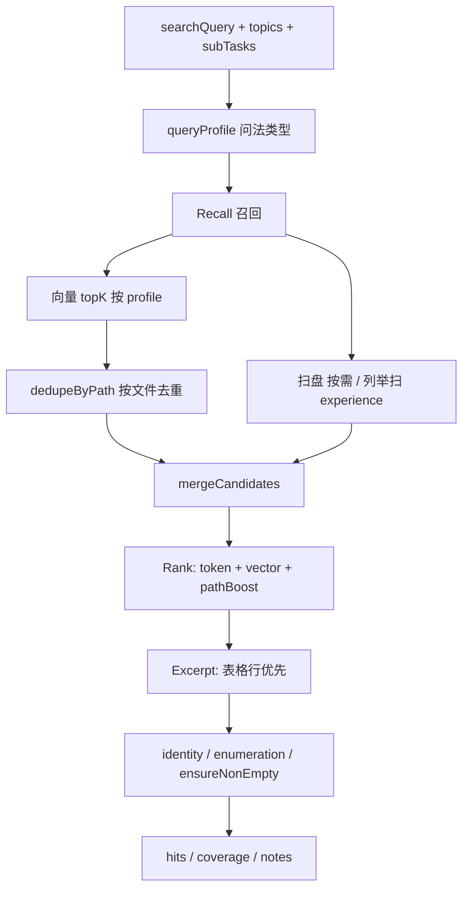

# KnowledgeManager 检索完善设计（KM v2）

> **状态：** 设计确认中 · **实现策略：** 一条一条加/改，每步可单独验收  
> **基线：** [§2.1.1 KM 规则精排已消坑](./04-pitfalls.md#211-km-移除在线-llm--规则精排p0-4--d3-2--d3-3--d3-5---已消坑-2026-06)（v1，无在线 LLM）  
> **原则：** 检索层不调 Chat LLM；快、稳、可回归；不动 Pipeline 对外合同（`hits / coverage / notes`）

---

## 一、v1 已有（本次不推翻）

| 能力 | 说明 |
|------|------|
| 向量召回 | `searchCorpusVectors`（Chroma 向量库） |
| 低置信/空 → 关键词扫盘 | `scanDocCandidates` |
| 规则精排 | token 打分 + `pickExcerpt` |
| 硬兜底 | `ensureNonEmptyHits`（候选非空 → hits 非空） |
| 无 LLM 精排 | `resultSource: "rule"` |

---

## 二、改动清单（逐条实施）

**图例：** 类型 = **新增** / **修改** · 状态 = ⬜ 待做 / 🔄 进行中 / ✅ 已完成

| ID | 类型 | 改什么（大白话） | 技术项 | 为什么 | 消坑 | 改哪些文件 | 计划日 | 状态 | 验收（一句话） |
|----|------|------------------|--------|--------|------|------------|--------|------|----------------|
| KM-01 | 修改 | 英文 **topics**（主题标签）只参与向量搜，不参与字面拆词 | topics 分流 | Intake 常带 `urban-governance` 等英文 tag，中文语料字面搜不到，相关度被算成 0 | D3-4 | `retrieve.ts` | D1 | ✅ | topics 含英文 tag 时，中文 query 仍能有 hits |
| KM-02 | 新增 | 向量结果按**文件 path**（路径）去重，同一 md 最多留 1～2 段 chunk（切块） | dedupeByPath | 12 条候选里 3+ 条同一简历，挤掉其他公司/项目文件 | D3-6 | `retrieve-helpers.ts`、`retrieve.ts` | D1 | ⬜ | 12 candidates 时 unique path 明显增多 |
| KM-03 | 新增 | **pathBoost**（路径加权）打分表：personal / experience / projects 加减分 | path 加权 | 「我的名字」误命中 `projects/resume.md`；项目问法偏模板文件 | D3-10、P0-15 | `km-config.ts`、`retrieve.ts` | D1 | ⬜ | 姓名类 Top1 为 `personal/`，非 resume 项目 |
| KM-04 | 新增 | 常量收到 **km-config**（集中配置）：topK、maxHits、L2 阈值、加权表 | 配置集中 | 魔法数字分散，难调、难对照坑点 | D3-7 | `km-config.ts` | D1 | ✅ | `getKmRetrievalConfig()` 可读全部参数 |
| KM-05 | 修改 | 打分公式：`相关度 = token + 向量分 + pathBoost`，封顶 1.0 | rank 公式 | 与 KM-03 配套落地 | D3-10 | `retrieve.ts` | D1 | ⬜ | 日志可见加权后 relevance 变化 |
| KM-06 | 修改 | `ensureNonEmptyHits` 兜底时按**加权后**最优候选补选，不只向量 Top1 | 兜底增强 | token 全未命中时仍应优先 personal/experience | D3-2 | `retrieve.ts` | D1 | ⬜ | candidates>0 且 token 弱时 hits 仍合理 |
| KM-07 | 新增 | **verify-km-retrieve** 脚本：不测全链路，只测 KM 规则 | 单测 | 改 KM 参数后可快速回归 | — | `scripts/verify-km-retrieve.ts` | D1 | ⬜ | `pnpm run verify:km-retrieve` 通过 |
| KM-08 | 新增 | **queryProfile**（问法类型）：identity / enumeration / tech / default | 问法识别 | 姓名、列举、技术栈不应共用 maxHits=5 | P0-15、R6-1 | `query-profile.ts`、`retrieve.ts` | D2 | ⬜ | 三类固定问法 profile 推断正确 |
| KM-09 | 修改 | 按 profile 分档 **vectorTopK / maxHits**（如列举 24/8，身份 12/4） | 分档参数 | 列举型需要更多 experience 文件进 hits | R6-1 | `km-config.ts`、`retrieve.ts` | D2 | ⬜ | 列举问法 maxHits=8 |
| KM-10 | 新增 | **表格 excerpt**：优先摘 markdown 表格行（如 `\| 姓名 \| xxx \|`） | 表格摘抄 | chunk 切在标题处时，线性截断缺姓名字段 | P0-6 上游 | `retrieve-helpers.ts` | D2 | ⬜ | 「我的名字」excerpt 含姓名表格行 |
| KM-11 | 新增 | **identityGuard**：有 `personal/个人简历*` 则强制 Top1 | 身份保底 | 复合问「我叫什么 年龄 职业」hits 波动 | P0-15 | `retrieve.ts` | D2 | ⬜ | 连问 3 遍 Top1 path 均为 personal 简历 |
| KM-12 | 修改 | 日志增加 `queryProfile`、`uniquePathCount`、`guardApplied` | 可观测 | 联调时一眼看出 KM 走了哪条策略 | — | `retrieve.ts` | D2 | ⬜ | agent-log 📤 含上述字段 |
| KM-13 | 修改 | 列举 profile 时**主动扫 experience/** 全目录（不只低置信才扫） | 列举召回 | 向量 topK 按相似度排序，易漏公司文件 | R6-1 | `retrieve.ts` | D3 | ⬜ | 「哪几家公司」candidates 覆盖 experience 多文件 |
| KM-14 | 新增 | **enumerationFill**：每个 experience/*.md（除 README）至少 1 hit | 列举保底 | 分析师只能念 hits 里的公司，KM 必须交全 | R6-1 | `retrieve.ts` | D3 | ⬜ | hits 含语料全部经历文件（如 4 家） |
| KM-15 | 修改 | 列举型 **coverage / notes** 文案（已补全 / 部分补全） | coverage 规则 | Analyst 需知列举是否穷尽 | R6-1 | `retrieve.ts` | D3 | ⬜ | notes 标明列举型补全状态 |
| KM-16 | 修改 | 同 path 多 chunk **合并 body** 再摘抄（上限 ~6000 字） | chunk 合并 | 单 chunk 信息不全，合并后 excerpt 更完整 | D3-6 | `retrieve-helpers.ts` | D3 | ⬜ | 同文件多 chunk 合并后 excerpt 更全 |
| KM-17 | 修改 | 同步 [02-agent-flows](./02-agent-flows.md) KM 流程图与步骤表 | 文档 | 与 v2 实现对齐 | D3-11 | `docs/` | D3 | ⬜ | 流程图含 profile / dedupe / guard |
| KM-18 | 修改 | 消坑表更新 D3-6、D3-10、R6-1 等状态 | 文档 | 逐条 KM-xx 完成后勾选 | — | `docs/04-pitfalls.md` | D3 | ⬜ | 对应坑标 ✅ 或 🔄 |

**刻意不做（本阶段）：**

| 项 | 原因 |
|----|------|
| KM 内 Chat LLM / rerank 模型 | v1 已证伪；以后可选 cross-encoder |
| Intake 输出 `queryType` 字段 | 第一期 KM 内规则推断，少动 Pipeline |
| 检索 cache（跨轮） | D5-2，属编排层 |
| Mem0 优先级 | P0-14，属 Analyst |
| 改 Chroma 切块策略 | 离线 Indexer 范围 |

---

## 三、2～3 日实施计划（KM 完善专项）

> 替换原质量冲刺 **第 6～7 天「KM 检索质量」** 的交付方式：由「一次大改」改为 **KM-01～18 逐条落地**。  
> 详见 [路线图 · KM 完善三日计划](./03-roadmap.md#km-完善三日计划2026-06)。

### D1 — 召回与打分基础（KM-01～07）

**目标：** 不大改结构，先让「找谁」更准。

| 顺序 | 做哪条 | 交付 |
|------|--------|------|
| 1 | KM-04 | `km-config.ts` 骨架 |
| 2 | KM-01 | topics 分流 |
| 3 | KM-02 | path 去重 |
| 4 | KM-03 + KM-05 | path 加权 + 打分公式 |
| 5 | KM-06 | 兜底增强 |
| 6 | KM-07 | verify 脚本 + 跑通 |

**当日验收问法：**

1. 我的名字是什么？  
2. 城管平台用了什么技术？（看 path 是否更贴项目）

**通过标准：** verify 绿；Web 问（1）仍 `resultSource: rule` 且快；Top1 非 `projects/resume.md`。

---

### D2 — 问法分档与身份类（KM-08～12）

**目标：** 稳「个人档案」类，excerpt 含表格字段。

| 顺序 | 做哪条 | 交付 |
|------|--------|------|
| 1 | KM-08 + KM-09 | queryProfile + 分档参数 |
| 2 | KM-10 | 表格 excerpt |
| 3 | KM-11 | identity 简历 Top1 |
| 4 | KM-12 | 日志字段 |

**当日验收问法：**

1. 我的名字是什么？  
2. 我叫什么 年龄 职业 从业经历？（连问 3 遍）

**通过标准：** excerpt 含 `\| 姓名 \|`；3 遍 Top1 均为 `personal/个人简历*`；日志有 `queryProfile: identity`。

---

### D3 — 列举型与文档（KM-13～18）

**目标：** 消 R6-1「哪几家公司只答 2 家」。

| 顺序 | 做哪条 | 交付 |
|------|--------|------|
| 1 | KM-16 | chunk 合并（可与 KM-02 联调） |
| 2 | KM-13 + KM-14 | experience 扫盘 + 一文件一 hit |
| 3 | KM-15 | coverage / notes |
| 4 | KM-17 + KM-18 | 文档 + 坑点表 |
| 5 | — | 可选跑 `golden:regression` G-工作经历 |

**当日验收问法：**

1. 我在那几家公司上过班？（连问 2 遍）  
2. 同句再问，hits path 集合一致且覆盖全部 experience 文件

**通过标准：** hits ≥ 语料 experience 文件数（如 4）；两次 path 集合相同。

---

## 四、架构示意（v2 完成后）

---

## 五、profile 参数表（设计定稿）

| queryProfile（问法） | 典型问法 | vectorTopK | maxHits | 扫盘 | 专项 guard |
|---------------------|----------|------------|---------|------|------------|
| identity（身份） | 我叫什么、姓名、简历 | 12 | 4 | 低置信时三目录 | personal 简历 Top1 |
| enumeration（列举） | 哪几家公司、全部公司 | 24 | 8 | **experience 全量** | 每经历文件 ≥1 hit |
| tech（技术） | 技术栈、用什么框架 | 16 | 6 | 低置信时三目录 | — |
| default（默认） | 其余 | 12 | 5 | 低置信时三目录 | — |

---

## 六、不在 KM 内但相关的后续项

| 坑 | 负责 Agent | 建议时机 |
|----|------------|----------|
| P0-14 Mem0 vs 语料 | Analyst | KM v2 后 |
| P0-12 hits 空仍编造 | Analyst | KM v2 后 |
| D5-2 同句再问全量检索 | 编排 + cache | KM v2 后 |
| R6-2 表格追问否定上轮 | Intake + Analyst | R6 专项 |

---

## 七、变更记录

| 日期 | 说明 |
|------|------|
| 2026-06 | KM-04 ✅ km-config；KM-01 ✅ topics 分流 |

---

## 八、v2 全部完成后 — KM 复盘清单

> KM-01～18 落地后，建议单独花半日过一遍（不必等 Analyst/cache）。

| 步骤 | 内容 |
|------|------|
| 1 | 读 `retrieve.ts` 主流程 + `km-config.ts`，对照本文 §四 架构图 |
| 2 | `pnpm run verify:km-retrieve`（KM-07 落地后）+ `verify:agent-schemas` |
| 3 | Web 三问：姓名 / 复合档案 / 哪几家公司 / 项目技术（各 1～3 遍） |
| 4 | 查 agent-log：`queryProfile`、`recallSource`、`resultSource: rule`、hits path |
| 5 | 更新本文 KM-xx 状态列；必要时补 `02-agent-flows` KM 步骤表 |

